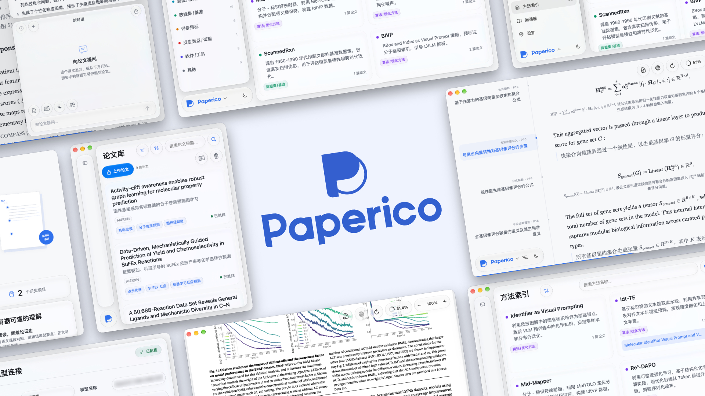
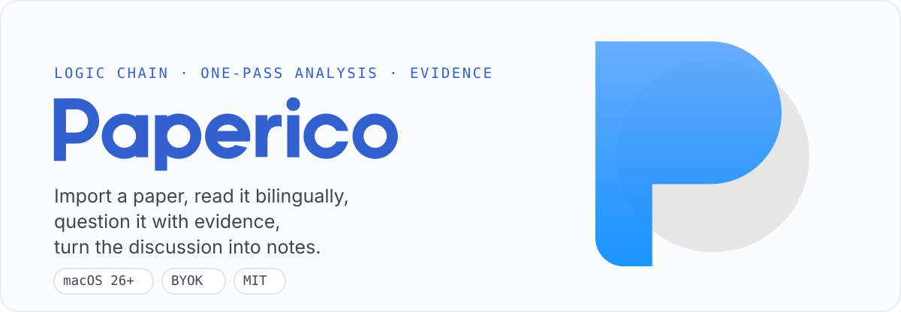
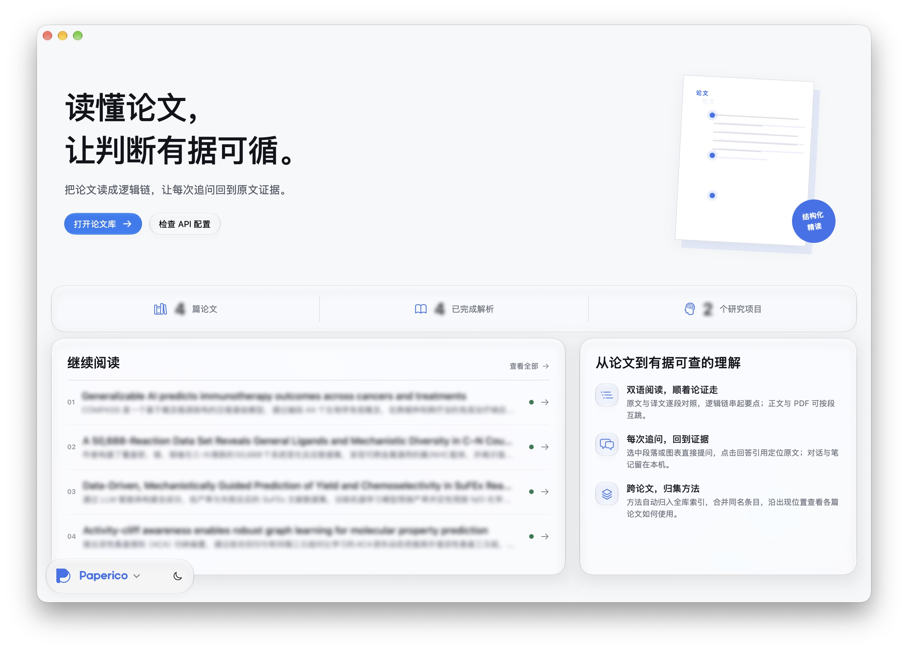
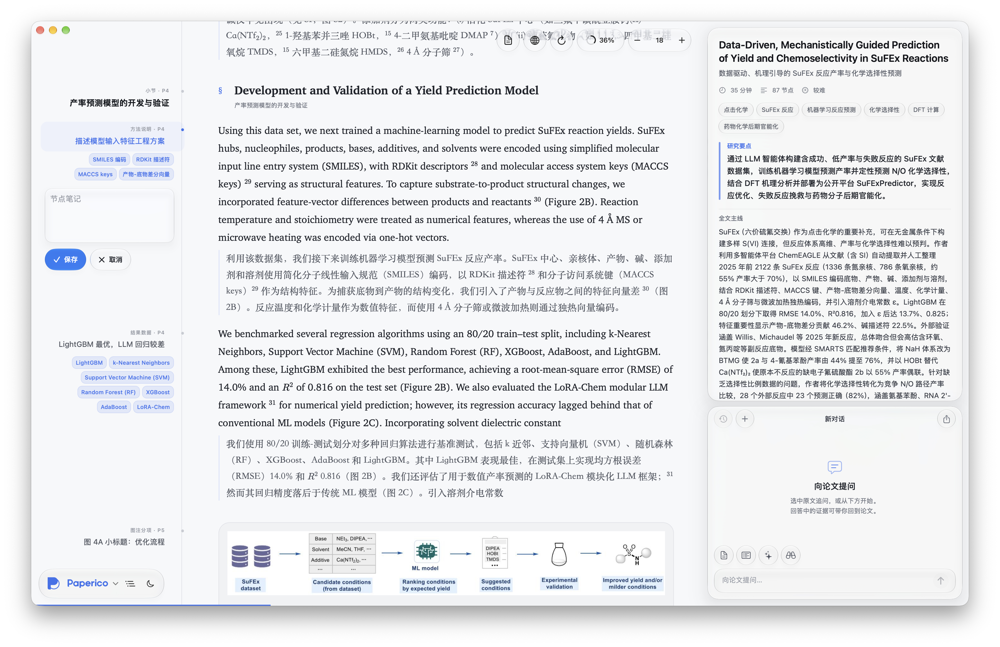
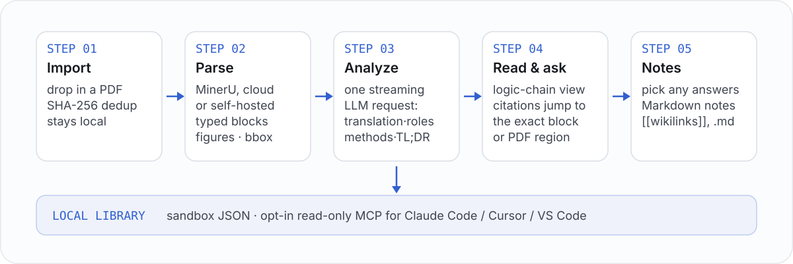

<p align="center">
  
</p>

<p align="center">
  
</p>

<div align="center">

[](LICENSE)
[](https://github.com/juliusloon/paperico/releases)

[English](README.en.md) · 简体中文

</div>

## Paperico 是什么

Paperico 是一款 macOS 原生论文精读应用。导入 PDF，用 MinerU 恢复结构，然后原文与译文对照
阅读，配合逻辑链大纲、方法卡片和随手可跳转的原始 PDF。提问时可附带选段、方法或图表，
回答中的有效 block 引用会直接定位到对应证据。

论文库保存在你自己的沙盒中，API Key 存于 macOS 钥匙串，App 直连你配置的服务。
**本地优先、自带 Key、无中转服务器。**

<p align="center">
  
</p>

## 核心差异

普通 PDF 阅读器优化的是"看清一份文档"；Paperico 把论文重组为带稳定 id 的类型化分块
逻辑链——大纲、译文、对话引用、方法卡片和批注共用同一套坐标。

- **读的是结构，不是页面。** MinerU 恢复标题、段落、图表、公式及其版面位置，出版元信息
  与参考文献被分离出正文链。你在重排版的双语精读面上阅读（衬线正文、离线 KaTeX），
  旁边是逻辑链大纲，每次跳转都精确落到原文段落或 PDF 区域。
- **全文翻译，与原文对齐。** 短论文使用一次流式 LLM 请求；长论文分段翻译，完成后再
  结合全文生成 TL;DR、核心贡献、难度估计与方法索引。严格校验节点编号、原文开头与完整性；
  已完整保存的响应可本地恢复，无需调用模型。手动继续中断的长文任务时复用已校验分段，
  只生成尚未完成的部分。
- **回答钉在证据上。** 选中文本、图表或方法卡作为上下文提问；回答中的 block 引用可以
  直接跳回来源段落，或在原始 PDF 中闪烁定位。方法实体跨整个论文库归并为你可持续整理的
  持久分组——可改名、可跨组拖动、可删除——而且每篇新论文都会参照你整理过的方法索引
  进行分析，一张方法卡列出它出现的每一篇论文与每一处段落。
- **本地优先、自带 Key、为存续而设计。** 管线支持云端任务断点续跑、排队任务不重新
  上传、应用重启后的中断对账、按内容哈希去重与可恢复的回收站；本地文件保存在沙盒，
  密钥保存在钥匙串；解析与 AI 请求会把内容直接发送给你配置的服务。
- **论文库会说 MCP。** 在「设置 → MCP 连接」打开默认关闭的 localhost 服务，为任何支持
  Streamable HTTP 的客户端提供 10 个只读工具
  和每篇论文的资源：元数据、双语正文块、图像、方法索引与笔记。Bearer Token 存于
  钥匙串，读取不触发任何付费调用，回收站内容对外部客户端封闭。

| | PDF 阅读器 / 翻译插件 | Chat-with-PDF 服务 | Paperico |
|---|---|---|---|
| 阅读面 | 固定页面，叠加翻译 | 片段查看器 | 重排版双语精读 + 原始 PDF，块级精确互跳 |
| 论文理解 | — | 单文件问答 | TL;DR、贡献、难度、逻辑链、方法索引 |
| 问答证据 | — | 至多到页级 | block 引用 → 段落或 PDF 区域 |
| 跨论文 | — | — | 全库归一的方法索引，驻留在可整理的持久分组 |
| 笔记 | 手工搬运 | 手工搬运 | 从选中回答合成为带双链的 Markdown |
| AI 代理访问 | — | — | 只读 MCP 服务器：10 个工具 + 论文资源，localhost + 钥匙串 Token |
| 数据与模型 | 本地文件 | 厂商云 | 沙盒 + 钥匙串 + 你自己的端点 |

## 你能得到什么

- **论文库**：项目分组、搜索、排序、多选移动、PDF 去重、批量导入逐文件错误报告。
- **任务管理**：待处理与失败队列，支持停止、重新解析、复用段落重新翻译；配置就绪后新导入自动处理。
- **双语精读**：原文与译文、逻辑链大纲、方法卡片、PDFKit 原文阅读与进度记忆。
- **证据问答**：可附带选段、方法或图表；引用可定位到来源段落或 PDF 位置。
- **方法分组**：跨论文方法索引驻留在持久分组中（8 个预设分组，支持跨组拖动、
  重名校验）；你整理过的方法身份会指导新论文的分析。
- **笔记**：选择对话生成 Markdown 笔记，支持导出。
- **回收站**：删除后保留 PDF、解析结果、对话和笔记，可随时恢复，也可逐篇确认后永久删除。
- **MCP**：默认关闭的 localhost 只读服务，提供 10 个工具、证据块与图像；在设置中复制客户端配置。详见 [连接说明](docs/mcp.md)。
- **原生桌面**：Liquid Glass、深浅色外观、自定义强调色、离线公式渲染、带可选更新检查的关于页。

详见[更新说明](docs/releases/v1.1.0.md)与[仓库分析与架构说明](docs/architecture.md)。

<p align="center">
  
</p>

## 运行

**安装**：从 [最新 Release](https://github.com/juliusloon/paperico/releases) 下载 dmg 安装即可。本 app 未使用 Developer ID
签名或 Apple 公证；正式分发的签名选项见 [macOS 开发说明](macos/README.md)。

**从源码构建**——要求 macOS 26+、Xcode 26+；已验证环境为 macOS 27 / Xcode 27、Apple Silicon：

```bash
git clone https://github.com/juliusloon/paperico.git
cd paperico
./script/build_and_run.sh
```

脚本会构建并启动 App；若系统选中 Command Line Tools 而标准路径已安装 Xcode，脚本会
为本次构建自动选择 Xcode。也可以打开 `macos/Paperico.xcodeproj`，选择 Paperico →
My Mac → Run。Codex 的 Run 按钮使用同一脚本。

首次使用：

1. 在论文库导入 PDF。尚未配置服务时，论文保留在本地，状态为待解析。
2. 在设置中保存 AI 模型的 Base URL、模型名与 API Key，测试连通性。
3. 配置 MinerU 云端 Token，或选择自己部署的本地 Gradio 服务。
4. 配置完成后，从处理任务页开始解析。
5. 阅读过程中点击回答的证据引用，可跳转到对应段落或 PDF 位置。
6. 可选：在「设置 → MCP 连接」开启只读服务，让外部助手读取论文库。

**本地优先不等于离线 AI**：使用云端 MinerU 会上传 PDF；模型端点会接收任务所需的论文文本和对话上下文。App 直连你配置的服务，Paperico 不提供中转服务器。

### 从 Zotero 迁移

适用 Zotero 7–10：

1. 在 Zotero 选择集合，导出格式选 **BibTeX**。
2. 勾选 **Export Files**，保留 `.bib` 和附件 PDF 的目录结构。
3. 在 Paperico 论文库点击“从 Zotero 导出导入”，选择文件夹与目标项目。

导入读取本地文件，不联网、不修改 Zotero。已配对的导出元数据视为手动信息；重复 PDF 或标识符
会跳过，未配对条目与损坏附件会在摘要中列出。导入后若服务已配置，解析/分析仍按正常数据流调用服务。

## 工作原理

<p align="center">
  
</p>

| 目录 | 职责 |
|---|---|
| `macos/Paperico/App/` | 启动、依赖注入、路由、主题和原生场景 |
| `macos/Paperico/Stores/` | 按设置、项目、论文、阅读和对话拆分的可观察状态 |
| `macos/Paperico/Core/` | 本地持久化、任务闸门、处理管线、服务客户端与 ZIP 读取 |
| `macos/Paperico/Pages/`、`Components/` | 页面、阅读器与通用控件 |
| `macos/Tests/`、`macos/Package.swift` | 不启动 UI、不调用外部服务的核心回归测试 |
| `script/` | 仓库级构建、启动、验证入口 |
| `docs/` | 架构与版本说明 |

## 数据与升级

App 沙盒中的数据根目录：

```text
~/Library/Containers/com.paperico.native/Data/Library/Application Support/Paperico/
├── library.json          # 版本化项目、论文、去重索引与回收站记录
├── pdfs/                 # 原始 PDF
├── papers/<id>/          # blocks、entities、chat、notes JSON
├── mineru_output/<id>/   # 解析结果与图表
├── analyses/<id>/        # 分析原始响应
└── logs/                 # 可选诊断日志
```

服务配置、外观与进度在 UserDefaults；API Key 与 MinerU Token 在 macOS 钥匙串。
存储错误会明确显示，损坏或未知版本的索引不会被当作空库覆盖。

1.1.0 将论文库升级到 schema v2，迁移前自动保留索引备份。升级后的库不能由 1.0.x
打开；作者、年份、期刊和 DOI 在新解析完成后识别，已完成旧论文可通过右键或批量“识别元数据”回填；编辑条目可手动维护这些字段。

可读取原生迁移期间的无版本 JSON 索引。**旧 Python 后端的 SQLite 论文库、Fernet
密钥和原生论文库仍是两份独立数据，目前不会自动转换**；升级前请保留旧数据库和存储目录。
备份原生库时请复制整个数据根目录，包括回收站引用的数据；钥匙串凭据需要单独管理。

## 验证与打包

```bash
./script/check.sh                    # 原生核心测试 + 完整 App 构建
./script/check.sh --with-backend     # 加跑已有后端测试、lint 和 DTO 契约检查（退役快照存在时）
./script/build_and_run.sh --verify   # 构建、启动并确认进程运行
./macos/scripts/make_dmg.sh CODE_SIGN_STYLE=Manual CODE_SIGN_IDENTITY=- DEVELOPMENT_TEAM=
```

DMG 输出在 `macos/build/`。发布打包在本地执行；`.github/` 下的 CI 与 release 工作流保留在
本地、不入公开仓库。本地构建使用临时签名，未经 Developer ID 公证；正式分发的签名
选项见 [macOS 开发说明](macos/README.md)。

贡献约定见 [CONTRIBUTING.md](CONTRIBUTING.md)，安全说明见 [SECURITY.md](SECURITY.md)。

[MIT](LICENSE) © 2026 juliusloon。
