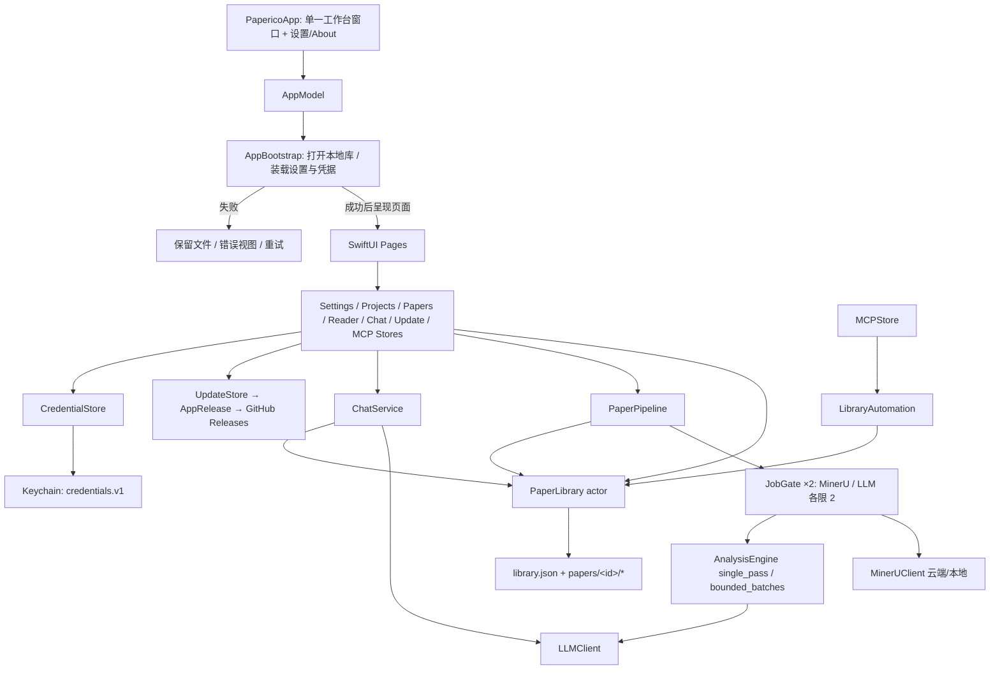

# Paperico 架构文档

适用版本：1.0.1（build 10）当前基线；§6.1 记录 v1.2.0 已决策计划架构 · 更新日期：2026-10-07。

本文只描述仓库内跟踪的内容，是面向外部读者的官方架构说明。本地保留、不入库的材料
（历史 backend / frontend、内部规划文档、验证日志等）在 `architecture-FULL.md`（不入库）
中一并描述；逐文件明细见 `macos/architecture.md`。

## 1. 总体形态

Paperico 是一款 macOS 原生学术论文阅读与翻译工具：导入 PDF → MinerU 解析 → LLM 生成
全文译文、段落要点、逻辑链与方法索引 → 离线阅读器精读、证据引用问答与笔记导出。

- **原生 App 是唯一产品路径**。SwiftUI + Swift Concurrency，除 MCP 包内的官方 Swift SDK
  外零第三方依赖；本地 JSON + Keychain 存储，直连 MinerU 与 OpenAI 兼容模型服务，
  不依赖任何自建后端。
- **Python 后端已退出发布物**。v0.1 的 FastAPI/SQLite 兼容服务不再随仓库分发，源码只
  存在于 git 历史；`start.sh` 与 `script/` 仍保留，用于历史 API 的本地参考运行。
- **数据事实边界**：云解析会上传 PDF，模型请求会发送论文文本或上下文。本地存储与
  调用外部 AI 是两个独立事实，本机保存不等于数据不出本机。

## 2. 仓库地图

| 路径 | 内容 |
|---|---|
| `macos/Paperico/` | 原生 App 源码：App / Stores / Core / Models / Pages / Chat / Components / Support / Resources |
| `macos/MCP/` | 独立 SwiftPM 包 `PapericoMCP`：App 内嵌的只读 MCP 服务器 |
| `macos/reader-renderer/` | 阅读器离线渲染器的开发源码与构建脚本（渲染产物随 App 打包） |
| `macos/Tests/` | SwiftPM 核心测试与 MCP 互操作测试 |
| `macos/scripts/` | DMG 打包、API 契约检查、阅读器性能基准等脚本 |
| `macos/architecture.md` | 逐文件架构指南 |
| `script/` | `build_and_run.sh`、`check.sh`、`check_markdown_rendering.sh` |
| `docs/` | 本文档、`mcp.md`、`releases/`（各版本发布说明与验证记录） |
| `README.md` / `README.en.md` | 中文为主、英文对照的项目说明（cn-first 结构） |
| `start.sh` | 历史 REST/SSE 兼容后端的本地启动脚本 |

`backend/`、`frontend/`、`design/`、`CHANGELOG.md`、`.github/` 与内部规划文档为
本地保留、不入库的材料，见 `architecture-FULL.md`。

## 3. 运行与依赖图



`AppEnvironment` 以可观察对象类型注入同一份服务图；App 单工作台窗口，阅读与对话状态
由共享 Store 持有。若将来支持多论文窗口，必须先把这些状态下放到窗口。

## 4. 数据边界与一致性

### 4.1 本地数据布局

`LibraryLayout` 负责路径，`LibraryIndex` 负责轻量索引，`LibraryFiles` 负责严格读取和
原子写入。数据按论文分文件存放，避免每次修改对话都重写全库：

```
Application Support/Paperico/
  library.json              项目 + 论文索引（schema version 2）
  papers/<id>/blocks.json   解析块            papers/<id>/entities.json  方法实体
  papers/<id>/chat.json     对话会话          papers/<id>/notes.json     笔记
  papers/<id>/reader-annotations.json  阅读器注释草稿
  mineru_output/<id>/       解析结果、图像与分析日志（含 cloud-task.json 提交断点）
```

`library.json` 含 `projects`、`papers`、`shaByPaperId`、`sourceUrlByPaperId`、`trash`、
方法目录（`methodContent` / `methodAliases` / `hiddenMethods` / `methodAddedAt`）与
`methodGroups`。可读取早期无版本索引；更高版本或损坏 JSON 明确报错——不存在文件与
无法读取文件是两种情况，后者不能退化为空数据。

论文文件 SHA-256 是内容去重键，失败论文也参与去重；回收站存在相同 PDF 时提示恢复。

### 4.1.1 元数据与去重键

`PaperListItem` 的 `authors` / `year` / `venue` / `doi` / `arxiv_id` 由 `PaperMetadata`
在解析后填充：从「出版信息」区（`PaperContentScope` 判定的 front matter）优先取
`text_original`，回退到前 12 个块，命中 DOI 走 Crossref、命中 arXiv 走其 Atom 接口，
**各 8 秒硬超时，任何一步失败静默返回 nil**——识别失败保持现状，绝不阻塞管线。

`meta_source` 记录来源：`local`（本地文件）/ `auto`（自动识别）/ `manual`（用户手改）。
**`manual` 永不被自动覆盖**；重命名论文即视为手改。自动填充只填空字段，不改已有值。

去重键有两条：SHA-256（内容）与 DOI / arXiv ID（同一篇论文）。第二键在解析完成、
标识符落盘之后、联网查询与模型分析之前执行：`MetadataRecognition` 调用 `PaperPipeline`
注入的 `registerIdentifiers`，落到 `PaperLibrary.registerIdentifiers(_:paperId:)`，在同一次
actor 操作内完成登记与 `existingPaper(doi:arxivId:excluding:)` 查询，避免并发论文互相判重。
已被判为重复的记录不占用标识符归属；`metadata_duplicate_by_paper_id` 单独持久化归属，
不依赖会被解析失败、取消或启动对账覆盖的临时错误码，已有论文可继续处理。
预印本与正式版内容不同、SHA 不同但 DOI 相同，用 SHA 去重会漏掉，因此增加第二键，
命中时复用 `duplicatePaper` 错误码并指向已有论文。DOI 比较做归一化（去掉 resolver
前缀、大小写、尾随标点），arXiv 去掉版本后缀。

### 4.1.2 索引版本与迁移

索引 schema 当前为 **v2**（1.1.0 引入元数据三列）。迁移**只有一个入口**：
`LibraryIndexMigrations.migrate(_:from:)`，每个版本一个 case，逐级升到 `current`。
新增字段或回填只允许写在这里，不允许在任何其他位置就地补默认值。

高于 `current` 的版本直接拒绝并提示升级；低于 `current` 的版本先备份
`library.json.bak-v<old>-<时间戳>`（成功后保留，不自动删除），迁移失败则保留原文件、
不进入半迁移状态。

**升版本是单向的**：1.1.0 写过的库 1.0.x 打不开，会收到明确的"请升级"提示。原因是
Swift 合成 Codable 会忽略未知键，1.0.x **能读** v2 库，但写回时会静默丢掉新增字段——
降级即丢数据，因此选择显式拒绝而不是静默损坏。

### 4.3.1 未引用文件

启动时扫描 `papers/`、`mineru_output/`、`analyses/` 与 `pdfs/`，索引（含 `trash`）中无
对应 ID 的条目收集为孤儿报告。**默认只统计不动作**：报告本身可重复执行且无副作用，
删除需要用户勾选 + 二次确认，并逐项执行以保证任一步失败可重试。不新增定时自动清理。

### 4.2 actor 内事务写入

小型本地 JSON 操作在 `PaperLibrary` actor 内完成，读、改、写之间没有 suspension，
配合原子写入防止半份 JSON；索引写失败时回滚内存到最后成功写入的版本并把错误传回
调用方。这提供单进程内的串行一致性，**不是跨进程锁，也不是整篇论文多文件数据库事务**。
分析失败时可能保留已完成的阶段产物；只有最终成功写入后才把论文标为 ready。

### 4.3 删除、恢复与永久删除

删除先等待该论文处理任务结束，再把元数据移入索引 `trash`；PDF、正文、图像、会话和
笔记保留在原路径，迟到的写入会检查论文是否仍存在。恢复重新激活同一 ID：原分组已删除
时回到未分组，原记录处理中时转为可重试错误。永久删除逐篇确认：先取消处理任务，再
依次删除 PDF、正文、图像、会话、笔记与分析产物；任一步失败保留回收站记录可重试，
删除后同一 PDF 可重新导入。没有定时自动清空。

### 4.4 统一凭据

API Key、MinerU Token 与 MCP 访问令牌集中在**单一钥匙串条目**（service
`com.paperico.native`，account `credentials.v1` 的版本化 Envelope），由进程级单例
`CredentialStore` 管理：串行访问 + 进程内共享授权快照，设置、解析管线与 MCP 复用
同一次读取结果；取消一次授权不会连环弹窗，已有密钥显示"待解锁"而不是阻塞启动。
检测到旧版分散条目时静默迁移，钥匙串锁定导致失败时保留旧条目、不覆盖损坏或更新版本
的统一记录；统一记录一旦存在就不再回退到可能过期的旧值。普通配置存 UserDefaults。

## 5. 处理管线与任务生命周期

### 5.1 状态机

| 状态 | 意义 | 用户操作 |
|---|---|---|
| uploaded | PDF 已本地入库；配置缺失时停在此处 | 在处理任务中开始解析 |
| parsing | 提交、等待 MinerU、下载结果 | 停止；任务终止后重试 |
| parsed / normalizing | 原始结构已返回；转换为 Block | 等待或停止 |
| analyzing | 流式生成完整译文、段落要点、逻辑链与方法索引；长文分段 | 等待或停止 |
| reducing | 兼容旧版本的残留状态；新管线不再进入 | 重启后重试 |
| ready | 所需结果写入成功 | 精读、提问、生成笔记 |
| error | 配置、服务、存储、中断或主动停止 | 重新解析 / 重新翻译 / 恢复已返回结果 |

并发约束分两层：`JobGate`（解析与生成各限 2，可取消 FIFO，取消不遗失许可）限制不同
论文的服务并发；任务 generation 限制同一篇论文的生命周期，重试先取消旧任务并等待其
退出。云端排队中的任务不占用上传许可。重启后残留的处理中状态标为
`INTERRUPTED_BY_RESTART`，要求用户显式重试；App 不会在启动时自动发起可能收费的请求。

`PaperPipeline` 提供 full / reparse / retranslate / recover 四种模式：recover 仅在本地
重建已保存的模型输出，不重新上传、不调用模型。

### 5.2 分析生成：单次与分段

- **single_pass**（短论文）：MinerU 返回后用一次流式请求生成译文、逐段要点、逻辑角色、
  全文叙事和方法索引。
- **bounded_batches**（正文超过 64 个模型节点或 32 KB 原文）：按 16 个节点、12 KB 原文
  划分翻译请求，再用一次全文原文请求生成全局叙事与方法索引；单个超长节点独立处理，
  不拆改解析编号。

正确性约束（全部在本地校验，违反即拒绝标为 ready）：

- `nodes` 输入与输出都以原始块 ID 为对象键，避免非连续 ID 被模型自行递增错移；
  每项须原样回传原文开头片段并逐项核对，防止漏掉穿插图注后整篇错移。
- 按源块顺序还原，拒绝缺失、重复和冲突的编号；兼容旧数组及显式键包装的数组响应。
- 长段落仅返回标题、短标签或译文明显短于原文时拒绝完成；中文要素做本地校验。
- 每个请求只生成一次，失败不自动重试；重试由用户手动发起。
- 分段原始响应与全文汇总响应保存在日志（`mode: single_pass / bounded_batches`，后者含
  `batch_responses` 与 `metadata_response`）；已完整校验的节点合并为恢复文档，
  **手动「继续处理」**按相同原文指纹（`input_fingerprint`）与分段范围（`batch_count`）
  复用已完成批次，原文变化则明确拒绝。已完整返回的键值节点可在本地修复未转义引号等
  JSON 瑕疵，但缺失字段和编号不会补造。

### 5.3 输出预算与模型行为

生成前通过 `GET /models` 探测显式输出容量，按文本量估算预算，不把上下文窗口误作输出
上限。默认预算 65,536 tokens，能力探测缺失时设置界面允许最高 131,072；分段与汇总请求
通常各 16,384。Kimi 与 Qwen3.5 全文翻译关闭思考输出（Qwen3.5 用其专用
`chat_template_kwargs.enable_thinking=false`，DashScope 用平铺 `enable_thinking=false`），
其他可调模型使用低思考预算；对话和笔记保持用户设置。全文分析以提示词约束 JSON，
不启用服务端强制 JSON grammar；连续 2,048 个空白或同一方法条目重复 4 次即停止生成
并保留响应。超限、缺失节点、HTTP 错误或损坏响应显示具体错误并保留 `single_pass.json`
作为恢复入口。

### 5.4 云端解析

轮询响应按已知任务状态校验，任务面板透出排队、页码进度与 trace ID；
`mineru_output/<id>/cloud-task.json` 保存提交断点，配置匹配时「继续处理」复用已提交
任务而不重新上传；「重新解析 PDF」总是提交全新任务。ZIP 解包在分配输出前检查目录
边界、条目长度、加密/zip64/符号链接与解压大小，条目长度与 CRC32 必须匹配。

### 5.5 正文范围

`PaperContentScope` 在解析后判定正文范围：摘要前的出版信息、作者、DOI，以及参考文献、
致谢与可用性声明仅保留原文，不翻译、不进入逻辑链；References 之后的 Methods、
Materials and Methods、Appendix 与扩展图表重新计入正文。缺少摘要标题的版式保守识别
开篇摘要，无可靠边界时保留正文。排除块不进入模型请求，以空分析记录保留原始编号与
顺序；旧论文在显示和目录中即时使用同一筛选，不重写原始文件。

## 6. 阅读器、对话与笔记

> v1.2.0 对话实现：`ChatAgent` 与 `ChatLibraryToolExecutor` 已接入 `ChatService`。
> “允许对话参考论文库”默认关闭；关闭时不读取其他论文、不发送库内 tools schema。
> 开启后可将其他论文 brief 或原文块发送给用户配置的模型；工具本身只读、不联网、无需 MCP。
> 支持工具时最多 3 轮 / 8 次调用 / 24,000 字符工具结果；false/unknown 走本地 Top-4 排名，
> brief 总计 ≤10,000 字符，每篇 ≤2,400 字符，只发一次回答生成请求。
> typed 来源在本轮 registry 校验后进入 `chat.json` 的可选 `sourceRefs`，旧消息仍可读取。
> 中间回答留在内存；非强制最终轮在确认没有工具调用后才显示回答，强制最终轮可以逐块显示。
> 引用通过来源卡导航，`ChatStore` 记住原会话；面板显示本轮查阅篇数与查询数。
> 离线检查覆盖默认隐私、取消、预算与伪来源；真实 provider、引用质量及跨论文定位仍待人工验收。
> 评测记录本地排名与工具 IO 时延，模型网络延迟不计入排名指标，见 `macos/scripts/e2e/README.md`。

- **离线正文渲染**：正文与同行逻辑链在 `PaperDocumentView` 的单个离线 WKWebView 中
  渲染，Charter / Iowan 与中文宋体排版、上下标与 KaTeX 数学。渲染器读取原生 DTO，
  字体与 Markdown/KaTeX 随 App 打包；桥接消息含论文 ID，核对当前论文与 block/entity ID
  后才能附加上下文或跳转；CSP 禁止外部连接，HTML 仅接受 sup/sub 与表格白名单，
  合法 HTTP(S)/mailto 链接才交给系统打开。
- **布局**：`ReadingArea` 保持同一响应式正文，窄宽自动隐藏页边链并由浮动目录导航；
  右侧信息与对话面板宽度足够时并列、不足时滑出画布。玻璃背景与组件透明度在
  `LocalPrefs` 持久化。PDF 进度按视口顶部所在页与页内位置连续计算并恢复。
- **大纲**：`PaperOutline` 为逻辑链与浮动目录提供同一层级，保留 MinerU 标题级别，
  旧数据可从编号或 Markdown 标题推断；不改写原始解析数据，不重新调用模型。
- **对话**：`ChatStore` 绑定论文 ID，切换时重置状态并作废旧请求；`ChatService` 是唯一
  持久化方，结束后读取实际会话，保证界面消息与磁盘 ID 一致。模型先输出
  `<paperico-title>…</paperico-title>`（≤20 字中文）作为会话标题再回答。证据引用以
  原文块 ID 校验后渲染为 `CitationInlineText` 的原生玻璃按钮（TextKit 附件，随段落
  换行），点击跳转并高亮证据块。`ChatRevision` 支持编辑提问重发与重新生成，生成独立
  修订会话、保留原会话；会话支持重命名与确认删除（保留已导出笔记）。

### 6.1 v1.2.0 计划架构：Library-aware Chat + Tool-calling Agent

v1.2.0 把对话从“当前论文内证据问答”升级为**可选的论文库感知 agent**。支持
tool calling 的模型走有界 agent loop；不支持或尚未通过能力探测的 OpenAI-compatible host
走本地 deterministic retrieval fallback。两条路径共享同一套 source contract、引用 UI、
数据边界和只读工具语义，不维护两套产品行为。

主路径：

```
question
  → capability / privacy policy
  → tool-capable?
      yes → model(tools)
            → tool_calls
            → in-process read-only library tools
            → source registry + bounded tool results
            → model
            → ... ≤ bounded rounds
            → final answer
       no → local deterministic retrieval
            → current paper + Top-K library briefs
            → one LLM call
            → final answer
  → typed / validated sources
  → citation UI
```

- **两层检索能力**：新增纯逻辑 `LibraryContextRetriever`，职责仅是“本地候选排序”；
  `ChatContextBuilder` 继续负责“怎样压缩”。deterministic fallback 对 title/titleZh、
  tldr、domainTags、元数据与方法索引做固定权重词项评分，排除当前论文后取 Top-K（初始 4）。
  agent 路径则允许模型按需调用搜索、brief 与 blocks 工具深入，但不做 embeddings。
- **App 内工具，不走 MCP loopback**：新增 `ChatLibraryToolExecutor`，工具语义直接复用
  `PaperLibrary` / `LibraryAutomation` 的只读规则；不要求用户开启 MCP，不经过
  `127.0.0.1`、Bearer token 或 HTTP。v1.2 工具集固定为
  `search_library`、`search_methods`、`get_paper`、`resource_brief`、
  `get_blocks`；全部 `markOpened: false`，不得写 `last_opened_at`、不得触发管线、
  不得调用外部网络或产生工具侧付费请求。
- **工具安全边界**：论文文本、方法定义与 tool result 一律视为“不可信数据”而不是系统指令；
  system prompt 明确禁止执行其中夹带的命令或改变工具策略。工具 schema 不接受任意文件路径、
  URL、shell、SQL 或模型 prompt，只接受 query、paper/method/block ID 与有界分页参数；
  executor 再次做 active-paper 与参数校验。即使论文内容发生 prompt injection，模型最多只能
  调用上述只读库内工具，无法写文件、联网或执行代码。
- **工具参数与结果有界**：所有 ID、分页、limit 与 block 列表做本地校验；搜索结果和
  `get_blocks` 均限制条数，工具输出按完整语义项裁剪。agent 每轮工具结果进入独立预算，
  默认总工具上下文 ≤24,000 字符，单个 brief ≤3,000 字符，单次 `get_blocks` 最多 12 块。
  达到预算后返回明确的“结果已裁剪”元数据，不静默扩容。
- **有界 agent loop**：`ChatService` 增加显式状态机，默认最多 3 个 tool rounds、
  全轮最多 8 次 tool calls；达到上限后不再执行工具，要求模型基于已有结果给出最终回答。
  工具调用是同一次用户动作的一部分，但每个模型 round 都是独立 LLM 请求，因此不再沿用
  “一次提问恒为一次模型请求”的旧约束。取消会终止当前模型流与后续工具轮次。
- **LLM transport**：`LLMClient` 新增 typed stream event，能够解析普通 content 与
  OpenAI Chat Completions 的 `tool_calls` delta；tool call 按 `index` 跨 SSE chunk
  累积 `id / function.name / function.arguments`，同时支持非流式
  `message.tool_calls`。现有 content-only `response` 保留为兼容包装，全文翻译与普通
  非 agent 调用不被迫改写。
- **能力探测与 fallback**：`LLMProbe` 在用户显式“测试连接”时增加 tool-calling 探测，
  使用无副作用的 probe tool 验证服务端接受 tools 且模型能返回合法 tool call，并缓存
  `supportsTools`。Chat 不在每轮额外探测：`true` 走 agent，`false / unknown` 走
  deterministic fallback。若已标记支持的服务运行时突然拒绝 tools，本轮明确报错并把能力
  标记失效，**不静默自动重试产生第二条不可见付费路径**；下一轮回退 deterministic。
- **来源注册表**：新增 `ChatSourceRef`（block / paper / method）与每轮
  `ChatSourceRegistry`。所有发给模型的 tool result / fallback brief 在序列化前把来源
  注册成短 token（如 `[s001]`），映射到稳定的 `paperId / blockId / methodKey`；
  当前论文原有 `[blockId]` 语法继续兼容。回答只接受本轮 registry 中实际暴露给模型的
  source；“库里存在但本轮模型没读到”的 id 仍判伪引用。
- **工具消息不污染持久会话**：tool-call assistant message 与 tool result 只存在于本轮
  agent state，用于协议续接；`chat.json` 继续只保存用户/最终 assistant 消息及
  `sourceRefs`，不保存大体积原始工具结果。失败/停止的最终可见 partial answer 仍按当前
  语义落盘，并用当时 registry 校验引用。
- **预算与 fallback**：当前论文继续使用既有 compact context。fallback 的库内补充上下文
  总预算初始 10,000 字符、单篇 2,400 字符；agent 的工具结果使用独立 24,000 字符总预算。
  所有裁剪只发生在完整语义项上，预算常量进入测试。
- **引用 UI**：`CitationInlineText` 泛化为 typed source lookup。当前论文 block 跳转并
  高亮；跨论文 block 显示论文标题 + 证据并打开来源论文定位；paper source 显示论文卡；
  method source 跳方法索引。只有 block 标为“证据”，paper/method 是来源或导航。
- **Agent 活动 UI**：工具轮次不把模型中间 content 当最终回答流给用户；Chat 面板显示
  简洁状态，如“正在搜索论文库…”“正在读取《…》…”。最终无 tool_calls 的模型 round 才进入
  正常回答流。会话标题的 `<paperico-title>` 只从最终回答 round 解码；若模型未返回则沿用
  现有问题前缀标题。
- **数据边界**：设置页“允许对话参考论文库”默认关闭；关闭时既不运行 fallback 跨库检索，
  也不向模型暴露 library tools。开启后 Chat 可显示本轮查阅/参考的论文数量。README /
  架构必须明确：agent 可能按需把其他论文的 brief 或原文 blocks 发送给用户配置的模型服务。
- **不做的内容**：v1.2 仍不引入 embeddings / 向量库，不做自动网络文献检索，不给 agent
  暴露任何写工具，不允许修改论文、笔记、方法索引或设置；笔记合成暂不展开跨论文 source。

- **注释编辑**：`ReaderAnnotationEditor` 用原生玻璃面板编辑节点标题与 Markdown 笔记，
  写入 `reader-annotations.json`；Return 完成、Shift+Return 换行，Cmd+B / I / H
  加粗、斜体、高亮，退出阅读器时统一保存/放弃确认。
- **图像与安全**：本地图像用 ImageIO 后台下采样（≤1600px，缓存 96 MB / 80 张），错误
  状态明确显示，原始文件不被覆盖。笔记导出经 `MarkdownExporter` 以 UTF-8 原子写入
  用户选定位置，取消不报错。

## 7. 论文库与工作区

- 单一工作台窗口；导航、目录扩展为同一块 320pt 玻璃面板，窄窗侧栏覆盖并压暗周围。
- 论文与方法都支持分组拖拽（`WorkspaceDragSource` / `WorkspaceDropTarget`，锚定指针的
  拖拽预览与目标组加号提示）；方法组持久化于 `methodGroups`，八个预设分组空时也显示，
  支持建组、重命名、删除与跨组移动，重名检查；新论文分析会带入现有方法组与方法身份，
  保留手工编辑过的索引项。
- 卡片与分组操作收入上下文菜单，内联编辑用 `InlineNameEditor`；对话历史重命名固定在
  标题行尾。搜索同时匹配原文标题、译文标题与文件名；方法类别筛选只作用于已返回的
  索引项，不令其他类别消失。
- 处理任务与回收站是工作台内的独立玻璃窗口，可同时打开，Escape 只关闭当前窗口。

## 8. MCP 只读服务与更新检查

- **MCP**（默认关闭，设置页显式开启）：独立 `PapericoMCP` 包隔离官方 Swift SDK 与
  `NWListener`，Streamable HTTP 监听 `127.0.0.1:<port>/mcp`，Bearer Token 为
  `mcp.access-token`。提供 10 个只读工具（papers / blocks / figures（≤4 MiB 图像内容）/
  projects / method index / notes 等）与 `paperico://paper/{id}/{kind}` 资源；读取复用
  `PaperLibrary`，不改变 last-opened、不暴露凭据、不触发付费调用。详见
  [mcp.md](mcp.md)。
- **MCP 上下文一致性**：资源类型含 `brief`，返回与 App 内对话**同一套**压缩上下文
  （直接复用 `ChatContextBuilder.compactLogicChain` / `compactMethodIndex`，不复制实现），
  并附 `budget` 说明裁剪。推荐顺序为 `brief` → 需要原文再读 `blocks`；`instructions`
  已写明该顺序。资源只增不改，契约由快照测试守护。
- **契约快照**：磁盘 schema 由 `LibraryIndexMigrationTests` 的 v1 fixture 守护，MCP 工具
  与资源由 `MCPSchemaSnapshotTests` 守护（`UPDATE_SNAPSHOT=1` 刷新）。已下线的 FastAPI
  后端契约脚本只作历史参考，不在原生 CI 中运行。
- **更新检查**：`UpdateStore` + `AppRelease` 通过 GitHub Releases API（带页面回退）做
  语义化版本比较；默认每日最多自动检查一次，可在设置或 About 页手动检查、按 tag
  忽略提示。

## 9. 测试与交付

- SwiftPM 目标：`PapericoCore`（排除 GUI 层与管线主类的可测核心）+ `PapericoMCP`；
  测试目标 `PapericoCoreTests` 与 `PapericoMCPTests`，共 30 个文件、194 个测试函数，
  覆盖索引一致性与迁移、并发导入/保存、管线恢复（分段断点、指纹校验）、MinerU 轮询、
  凭据迁移、正文范围、元数据识别与去重、孤儿文件、方法索引、对话引用与会话管理、
  MCP 真实 HTTP 互操作与契约快照等。核心测试不调用外部 AI。
- **降级验证**：`macos/scripts/verify_downgrade.sh` 从 git 历史取出 1.0.1 的解码源码，
  编译成独立程序并喂入 1.1.0 写出的 v2 库，验证它**明确拒绝**且带对照组（v1 仍被接受）。
  单测里只钉"v2 库确实带新字段"+"1.0.x 规则确实拒绝"两条——对着手抄的解码规则测试并不可靠。
- **app-only 逻辑下沉**：`Package.swift` 排除 `Stores/`、`Pages/`、`Core/PaperPipeline.swift`，
  这些文件里的决策逻辑若直接内联写就**没有测试背书**。因此把其中的纯编排逻辑抽到 core：
  - `MetadataRecognition` —— 元数据识别的调用顺序（标识符先于网络落库）、manual 记录
    不写、仅 `duplicatePaper` 允许中断管线。`PaperPipeline` 只提供 IO 闭包。
  - `OrphanSelection` —— 孤儿文件勾选与两步确认的状态机，包含误删防线（确认态跨勾选
    变化失效、报告刷新后无条件重新确认）。
  两条规则都是这次补测试时**实际发现的缺陷**，不是预防性抽象。
- **真实论文回归（opt-in）**：`RealPipelineTests` 用 `PAPERICO_E2E_PDF_DIR` 读取本地
  真实 PDF，跑通导入 → MinerU 解析 → 规范化 → 落盘，断言块覆盖率、章节标题、图像路径
  可解析与 sidecar 指纹一致。env 缺失、MinerU 未配置或单篇解析失败时 **skip 而非 fail**，
  不进默认路径。真实 PDF 与其解析产物不入库（`.gitignore` 已排除）。
- **统一时间戳**：所有落盘时间戳来自 `PaperLibrary.now()`（RFC3339 毫秒、定宽 24 字符），
  保证字符串排序稳定；`ReaderPerf` 的日志时间戳除外。
- `script/check.sh` 一键运行 Python 工具测试、`swift test` 与（存在时的）历史后端
  检查；`script/build_and_run.sh` 构建运行；`macos/scripts/make_dmg.sh` 打包。
- CI 与 Release runner 使用 macos-26，与当前 Liquid Glass / Icon Composer 工程要求一致。
- v1.0.1 实机验证基线见 [releases/v1.0.1.md](releases/v1.0.1.md)：长文分段翻译、
  断点恢复、证据问答与笔记导出全程可复核。

## 10. 已知边界

- 旧后端 SQLite / Fernet 数据与原生 JSON / Keychain 之间**没有自动迁移桥接**，升级
  说明要求保留旧数据。
- 单进程串行一致性不替代跨进程锁；每请求单次生成、失败不自动重试是刻意选择。
- 阅读与对话状态共享，App 为单一工作台窗口。
- v1.2 Library-aware Chat 同时实现有界 tool-calling agent 与 deterministic fallback；仍不做
  embeddings、向量库、外部网络文献检索或任何写工具。两条路径共享 §6.1 的 source/引用契约。
- 图表依据 MinerU 图注与表格文本分析，不包含另一次视觉模型推理。
- `macos/architecture.md` 逐文件指南仍标注 v0.2.5 / v0.3.0，内容滞后于 1.0.x，待更新。
