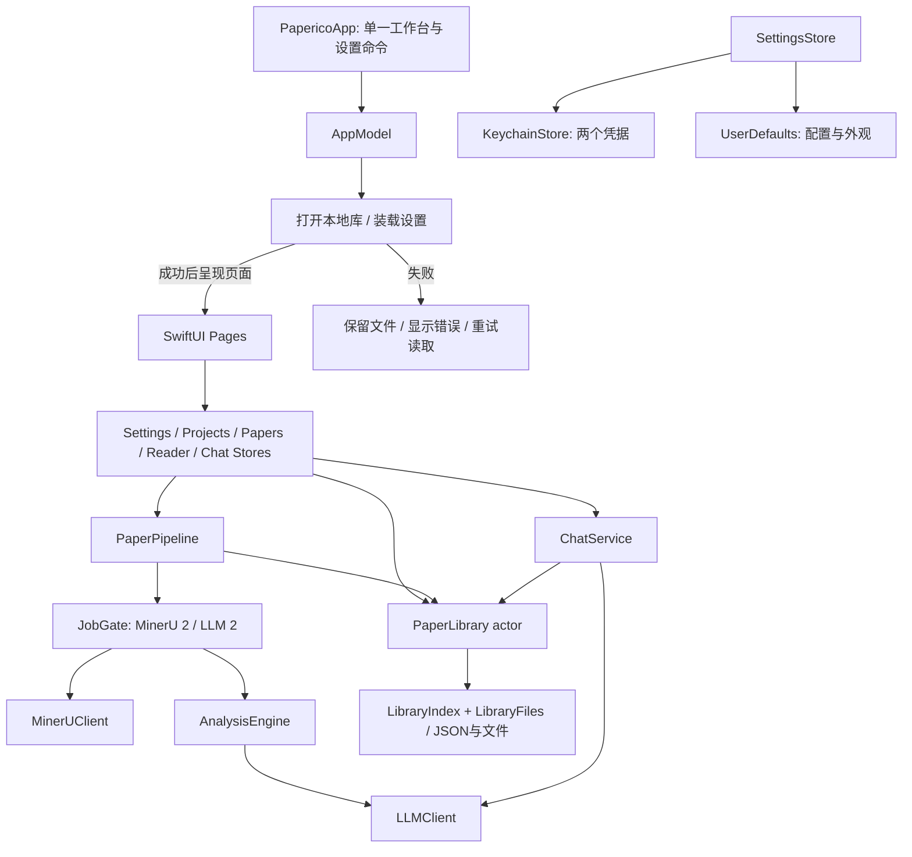

# Paperico 仓库分析与架构整理

分析日期：2026-10-04。对应 App 版本：0.3.0（build 8）。

## 1. 判断与重构方向

Paperico 的核心价值是把 PDF、结构化段落、论文论证、证据问答和笔记串成一条阅读流程。
原有后端已经覆盖任务限流、存储迁移、去重、回收站和中断对账；这些机制是产品可靠性的
组成部分。原生迁移需要保留这些能力，不能只把网络调用换成 Swift。

工作区在本轮开始前已有大量未提交的原生迁移与界面改动，`Networking/ApiClient.swift`
已删除，`Core/` 已实现直连 MinerU、模型服务和 JSON 论文库。本轮保留这些工作，并把
重构集中在数据正确性、任务生命周期、界面闭环、模块边界和可验证交付上。

当前确定的方向是：**原生 App 为主产品，Python API 为独立兼容组件**。原生运行路径
不再依赖 `start.sh`、FastAPI、SQLite、后端环境变量或后端配置接口。保留后端便于旧 API
用户继续使用，也保留已有算法和契约的参考实现。

## 2. 仓库地图

| 区域 | 当前角色 | 整理后的边界 |
|---|---|---|
| `macos/Paperico/App` | App 生命周期、主题、窗口、路由 | App 入口只声明场景；AppModel 装配服务；AppEnvironment 统一注入 |
| `macos/Paperico/Stores` | 可观察界面状态 | 设置、项目、论文、阅读、对话各一个文件，不再合并在两个大文件里 |
| `macos/Paperico/Core` | 原生数据与业务服务 | 文件写入、索引版本、并发闸门独立于处理管线与视图 |
| `macos/Paperico/Models` | Codable 值模型 | 论文状态移到这里，核心测试无需引入主题或 SwiftUI |
| `macos/Paperico/Pages` | 首页、论文库、方法、设置、阅读器 | LibraryManagementSheet 提供任务和恢复操作；设置命令直接跳转到工作台内的设置页 |
| `macos/Paperico/Components` | 共用视觉控件 | LocalPaperImage 专门读取本地图像，避免沿用 HTTP 图像加载器 |
| `macos/Package.swift`、`Tests` | 原生核心验证 | SwiftPM 只编译需要验证的核心代码，不另造 GUI target |
| `script`、`.codex/environments` | 本地开发入口 | Run、验证、构建复用同一套脚本 |
| `backend` | v0.1 兼容 REST/SSE 服务 | 独立保留测试与版本，不把原生迁移包装成 API 破坏性变更 |
| `docs` | 当前架构与历史记录 | 当前入口和版本说明优先；早期 backend/web 计划保留为历史材料 |
| `frontend`、`design` | 被 gitignore 的本地历史资料 | 不参与 App 构建，也不恢复为第二个产品入口 |
| `Workbench.md` | 既有本地工作材料 | 本轮保留，未作为发布文档或自动执行指令 |

## 3. 运行与依赖图

`AppEnvironment` 注入同一份服务图。原来的可选 EnvironmentKey getter 会在 SwiftUI
修改环境键路径时被调用，尚未赋值的默认 nil 被强制解包，导致主线程 SIGTRAP。
可观察对象的类型注入消除了这个问题。实际启动和窗口检查已验证修复，而不是仅凭构建成功判断。

App 采用单一工作台窗口，符合当前共享 Router、ReaderStore 和 ChatStore 的所有权。
如果将来支持独立多论文窗口，必须先把阅读与对话状态下放到窗口，而非直接恢复多窗口创建。

## 4. 数据边界与一致性

### 4.1 本地数据

`LibraryLayout` 负责路径，`LibraryIndex` 负责轻量索引，`LibraryFiles` 负责严格读取和原子写入。
论文正文、实体、会话、笔记和 sidecar 按论文分别存放，避免每次修改对话都重写所有论文正文。

`library.json` 使用 schema version 1，可读取早期无版本原生索引。更高版本和损坏 JSON
明确报错。不存在文件与无法读取文件是两种不同情况，后者不能退化为空数据。

论文文件 SHA-256 是内容去重键。失败论文也参与去重，用户应该重试原记录；回收站里
存在相同 PDF 时提示恢复，避免再次创建一份文件和历史。

### 4.2 为何改掉 detached 文件写入

原实现虽用了 actor，但每次读取和写入都启动 detached Task 并 await。Actor 会在这些
等待点允许其他调用进入，因此两个会话保存可能都读取同一份旧 JSON，再分别写回，丢失
其中一份更新；索引的较旧快照也可能最后写入磁盘。

现在小型本地 JSON 操作在 PaperLibrary actor 内完成，读、改、写之间没有 suspension。
调用 UI 仍通过 await 进入 actor。文件原子写入防止半份 JSON，索引写失败时回滚内存到
最后成功写入的版本，并把错误传回调用方。

这提供单进程内的串行一致性，**不是跨进程锁，也不是整篇论文多文件数据库事务**。
全文分析失败时可能保留已完成的解析或分析文件，这是可恢复的阶段产物；只有最终
成功写入后才把论文标为 ready。

### 4.3 删除与恢复

删除先等待该论文处理任务结束，再把元数据移入索引的 trash 列表。PDF、正文、图像、
会话和笔记保留在原路径。迟到的 block、entity、chat、note 和 sidecar 写入会检查活动
论文是否仍存在，不能为已删除论文继续新增数据。

恢复重新激活同一个 ID。原分组已删除时回到未分组；原记录处于处理中时转为可重试的
错误状态。回收站现支持逐篇确认后的永久删除：先取消该论文的处理任务，再删除 PDF、
正文、图像、会话、笔记与分析产物；任一步失败保留回收站记录可重试，永久删除后同一
PDF 可重新导入。仍没有定时自动清空。

### 4.4 凭据与网络

API Key、MinerU Token 存 Keychain；普通配置存 UserDefaults。钥匙串更新采用原地
更新，再在条目不存在时新增，避免“先删后写”失败时损坏既有凭据。保存失败会反馈到界面。

云解析会上传 PDF，模型请求会发送论文文本或上下文。数据文件本地保存与调用外部 AI
是独立事实，README 已修正过去“所有内容都不离开本机”的表述。

旧后端 SQLite / Fernet 与原生 JSON / Keychain 没有自动迁移桥接。后端原文件不被本轮
操作转换或删除，当前升级说明要求保留旧数据。未来迁移应提供预览、计数校验、引用重建
和失败回滚，并覆盖 PDF、实体、聊天、笔记与图像，而非仅导出论文标题。

## 5. 处理状态与任务生命周期

| 状态 | 意义 | 用户操作 |
|---|---|---|
| uploaded | PDF 已本地入库；配置缺失时停在此处 | 在处理任务中开始解析 |
| parsing | 提交、等待 MinerU、下载结果 | 停止；任务终止后重试 |
| parsed / normalizing | 原始结构已返回；转换为 Block | 等待或停止 |
| analyzing | 流式生成完整译文、段落要点、逻辑链与方法索引；长文分段 | 等待或停止 |
| reducing | 兼容旧版本的残留状态；新管线不再进入该阶段 | 重启后重试 |
| ready | 所需结果写入成功 | 精读、提问、生成笔记 |
| error | 配置、服务、存储、中断或主动停止 | 重新解析，或复用已有 block 重新翻译 |

并发约束分为两层：JobGate 限制不同论文的服务并发；任务 generation 限制同一篇论文
的生命周期。重试先取消旧任务，并等待其退出；旧 generation 的 defer 不能删除新任务
注册项。取消排队项会恢复对应 continuation，队列不会因取消而遗失许可。

重启后残留的处理中状态标为 `INTERRUPTED_BY_RESTART`，要求用户显式重试。
当前原生实现不会像旧后端一样在启动时自动发起可能收费的分析请求。

解析与分析队列目前各限 2 个论文任务。短论文在 MinerU 返回后，用一次生成请求返回翻译、
逐段要点、角色、全文叙事和方法索引。正文超过 64 个模型节点或 32 KB 原文时，先按 16 个节点、
12 KB 原文划分翻译请求，再用一次全文原文请求生成全局叙事和方法索引。单个超长原始节点独立处理，
不拆改解析编号。每个请求只生成一次，失败不自动重试。`nodes`
输入和 `nodes` 均使用原始 ID 作为对象键，避免非连续 ID 被模型自行递增而错移；单字母图中分面标签
原样在本地保留，不进入模型生成。本地按源块顺序还原，拒绝缺失、
重复和冲突的编号。新请求还要求每项原样回传原文开头片段，逐项校验它与编号对应，避免漏掉穿插图注后整篇错移。
跨页半句仍独立翻译。兼容旧数组及显式键包装的数组响应。正文优先生成，全篇总结与方法索引在后；
全库方法目录仅用于同名匹配，不能照抄或生成没有本篇引用的条目。流式解析
按完整节点更新真实计数，方法全篇去重，引用必须属于原始节点；只有全部节点按原编号、
原顺序通过校验并成功落盘，才标为 ready。长段落仅返回标题、短标签或译文明显短于原文时也拒绝标为完成。
分段原始响应和全文汇总响应保存在日志中；已完成节点合并为可校验的恢复文档，未完成全文不会误标 ready。
手动「继续处理」按相同原文指纹和分段范围复用已完整校验的译文；重新翻译与重新解析从头开始。
已完整返回的键值节点可在本地恢复未转义引号或外层括号错误，保留译文原样；缺失字段和编号不会补造。

生成前通过 GET /models 探测显式输出容量，按文本量估算全文输出预算，并受服务端容量
限制；不把上下文窗口误作输出上限。Kimi 与 Qwen3.5 全文翻译关闭思考输出，其他可调模型使用低思考预算；对话和笔记保持用户设置。
Qwen3.5 使用其专用 `chat_template_kwargs.enable_thinking=false` 开关，DashScope 使用平铺的 `enable_thinking=false`；
只设置通用 reasoning_effort 不足以切换其服务端模板。分段和汇总通常各用 16,384 输出预算，超长单节点仍按文本量提高。
默认预算为 65,536 tokens；能力探测缺失时设置界面允许最高 131,072。全文分析通过提示词约束 JSON，
不启用兼容服务端的强制 JSON grammar，以避开引号之后持续生成空白的故障。连续 2,048 个空白
或同一方法条目反复出现 4 次时，会停止生成并保留响应，不自动发起第二次请求。
云端解析管线已加固：轮询响应按已知任务状态校验，任务面板透出排队、页码进度与
trace ID；`mineru_output/<id>/cloud-task.json` 保存提交断点，配置匹配时"继续处理"
复用已提交任务而不重新上传；排队中的任务不占用上传许可；"重新解析 PDF"总是提交
全新任务。
全文输出容量与实际输出费用不同，最终用量取决于模型返回的 token。超限、缺失节点、
HTTP 错误或损坏响应会显示具体错误并保留 single_pass.json（兼容既有恢复入口），不会在失败后
自动补译或再次生成。日志 mode 区分 single_pass 和 bounded_batches；后者还保存 batch_responses
与 metadata_response。重试须由用户手动发起。图表依据 MinerU 图注与表格文本分析，
图片保留本地显示；不包含另一次视觉模型推理。
`PaperContentScope` 在解析后判定正文范围：摘要前的出版信息、作者、DOI，以及正文后的
参考文献、致谢与可用性声明仅保留原文，不翻译、不加入逻辑链。章节范围可以重新进入正文：
References 后的 Methods、Materials and Methods、Appendix 和扩展图表等继续翻译，并在后续出版信息处再次排除。缺少摘要标题的期刊版式
可保守识别开篇摘要；没有可靠边界时保留正文。正文内部的文献编号不受影响。排除块不进入
模型请求，保存和恢复时以空分析记录保留原始编号与顺序；正文、图注、公式、全文总结和方法
索引使用全文原文进行全局分析。旧论文在显示和目录中即时使用同一筛选，不重写原始文件。
严格失败后可在任务菜单恢复已返回结果，仅本地解析与校验，不发起模型请求；
含源文指纹的记录若原文变化则拒绝恢复，缺少节点仍明确报错。

## 6. 阅读、问答与图像

ReaderStore 用请求版本阻止旧论文加载结果替换当前论文。刷新正文不再写 last-opened
时间，性能追踪与状态轮询也分别运行，开启追踪不会阻塞轮询。

ChatStore 绑定论文 ID，在切换时重置界面状态并作废旧请求。生成期间锁定会话切换；
ChatService 是唯一持久化方，结束后读取实际会话，避免 UI 自造的消息 ID 和磁盘 ID 不同。
这对选择消息合成笔记尤其重要，否则新生成消息无法在持久化会话里找到。

`MarkdownExporter` 将原生保存面板限制在单一辅助服务中，界面只传入已保存的笔记。
用户选定目标后，服务在临时文件访问范围内以 UTF-8 原子写入；取消不报错，写入失败
回到对话面板显示错误。此桥接不参与模型请求或库内笔记持久化。

本地图像使用 ImageIO 在后台下采样到最大 1600 像素，内存缓存上限 96 MB / 80 张。
错误状态明确显示，不让表格图片因加载失败一直转圈。原始文件不被下采样覆盖。

LLM 配置中的输出上限和对话 streaming 开关进入实际请求。对明确拒绝 `max_tokens`
或 temperature 的响应有有界兼容重试；授权错误与无关错误不触发参数调整。服务 URL
校验避免畸形配置导致强制解包崩溃。

MinerU ZIP 在分配输出前检查目录边界、条目长度、加密/zip64/符号链接和解压大小。
条目长度与 CRC32 必须匹配。验证包含所有截断前缀，以及目的目录已有符号链接的情况。
这些约束不替代对用户配置的服务商本身的信任判断。

## 7. 发现、修复与验证对应关系

| 优先级 | 原问题 | 处理 | 验证 |
|---|---|---|---|
| P0 | 服务环境 nil 强制解包，App 构建成功却启动崩溃 | 改用 Observable 类型注入 | 原始崩溃报告、重启进程与实际窗口 |
| P0 | 读写错误被 try? 忽略，损坏索引被当作空库 | 严格读取、抛错、启动错误视图 | 损坏 / 高版本索引保持原样 |
| P0 | Actor 在 detached IO 等待点重入，丢失并发保存 | 事务段无 suspension，原子写入、索引回滚 | 30 个并发导入和 25 个会话保存 |
| P1 | 删除立即移除全部本地文件 | 可恢复 trash 索引 | 跨启动恢复 PDF、会话和笔记 |
| P1 | 取消等待任务占用队列；旧任务清理新注册项 | 可取消 FIFO + generation + 等待退出 | 限流、排队取消、错误后释放许可 |
| P1 | 对话切换串页，临时 ID 无法生成笔记 | 论文绑定、请求版本、读取实际会话 | 构建与界面检查；跨论文真实流式场景尚待服务联调 |
| P1 | ZIP 路径/长度缺少校验 | 防路径越界、符号链接、CRC 和内存限制 | stored / deflate、截断、坏校验和、越界名称 |
| P1 | 本地图片仍走 HTTP loader；无效配置强制解包 | ImageIO 本地读取、统一 URL 校验 | 完整构建、URL 回归；真实论文 24 张图像路径有效 |
| P2 | 文档描述旧后端，系统要求与 target 不符 | 原生主入口、兼容后端单列、更新系统要求 | 文档与 target、脚本一致性检查 |
| P2 | 原生层没有自动测试入口 | SwiftPM 核心测试、统一 check 脚本、CI | 本版 40 项原生测试；兼容后端此前通过 76 项测试、lint 与 14 schema 契约 |

## 8. 交付与尚存边界

本地完成 Debug 完整构建、进程启动验证、主窗口、论文库、管理面板、快捷键和设置页
检查；核心测试不调用任何外部 AI。本版另在安装后的 App 中使用已配置服务，实测
`s41467-026-75713-2.pdf`：MinerU 上传、解析、下载与解包得到 247 个节点、24 张图像，
一次模型生成完成全文译文、段落逻辑与 32 项方法索引，随后完成带原文证据的问答和笔记生成。
笔记通过系统面板导出为 `.md`，内容与库内版本逐字节一致；重启后 5 个论文数据文件的
SHA-256 保持一致，界面中的正文、方法与历史问答恢复正常。
本次验证覆盖这份测试论文；跨论文流式切换及其他服务、解析格式组合仍需分别验证。

CI 与 Release runner 使用 macos-26，与当前 Liquid Glass / Icon Composer 工程要求
一致；可用工具链依据 [GitHub 官方 runner 镜像说明](https://github.com/actions/runner-images/blob/main/images/macos/macos-26-Readme.md)。
远端 CI 需在提交后运行，本轮本地通过不能等同于 GitHub workflow 已执行。

下一轮工作建议按依赖关系推进：

1. **旧库迁移与可移植备份**：为 SQLite → JSON 提供有校验的导入，补充原生库导出恢复。
2. **服务协议回归**：把 MinerU 云/Gradio 与模型 SSE 的真实响应制作成脱敏 fixture，验证
   网络重试、不同解析结果版本、流中断和部分结果恢复。
3. **可观测的处理进度**：扩展阶段耗时与返回节点诊断，避免把网络等待
   与实际工作进度混为一谈。
4. **长库与长文性能**：量化索引整体写入与大正文重绘；数据达到大规模时评估 SQLite/SwiftData，
   而非为了架构形式立即增加存储框架。
5. **Swift 6 与强类型响应**：逐步减少 `[String: Any]` 边界并启用严格并发检查；保留平台
   实际构建，不能把宏替换后的 typecheck 当成 GUI 可运行的证据。
6. **产品扩展**：多论文联合对话、多个模型角色配置、更多导入来源与多窗口阅读，应建立在
   上述数据与生命周期边界稳定之后。

## 10. 正文排版与原生边界（v0.2.3）

正文与同一行的逻辑链集中在 `PaperDocumentView` 的单个离线 WKWebView 中，恢复网页的
Charter / Iowan 与中文宋体排版，并支持上标、下标和 KaTeX 数学排版。它读取原生 DTO，
不装载历史前端，不启动 HTTP 服务，不参与数据存储或模型请求。Markdown 渲染器和字体
随 App 打包；开发源码、固定依赖与生成脚本在 `macos/reader-renderer`。

桥接消息包含 paper ID，原生协调器核对当前论文、block / entity ID 后才能附加上下文或
跳转。正文资源仅开放自己的 Bundle 子目录；图表按合法 block ID 经原生文件布局读取。
CSP 禁止正文发出外部连接，原始 HTML 仅接受 sup/sub，表格使用标签与属性白名单。
用户点击合法 HTTP(S) / mailto 链接才交给系统打开。对话与笔记仍由原生 Store 管理。

右侧信息和对话为同底色的悬浮卡片。可用宽度必须容纳逻辑链、500pt 正文、当前卡片
宽度及间隙，否则隐藏卡片并提供打开按钮；900pt 以下沿用正文/逻辑链/对话标签。
`ReaderDivider` 仅桥接分隔柄输入，使用屏幕坐标追踪鼠标，不在移动中的本地坐标系累计
位移；拖动时禁止动画，松手时保存宽度。文档宽度变化只重排现有 DOM，不重建全部段落。

## 11. 统一阅读布局与玻璃画布（v0.2.4）

阅读器不再根据宽度切换独立的分页树。`ReadingArea` 保持同一个离线正文，900pt 以下
自动隐藏页边链，`FloatingTableOfContents` 提供章节导航。右侧 `RightPanel` 保持挂载，
宽度足够时并列，不足时滑出画布，打开后从右侧滑入；对话输入状态无需重新创建。
紧凑导航在阅读器和工作台页的最上层覆盖，不为按钮保留底部空栏。

背景透明度与玻璃组件透明度分别在 `LocalPrefs` 持久化，并由可观察的 `AppStore` 注入
窗口画布与玻璃环境。设置中的背景透明度限于 0–50%，玻璃透明度提供 0–30% 的实时调节；只改变
`GlassSurface` 的材质层，不改变文字与图标。浅色和深色统一使用原生 regular 玻璃。
`WindowChrome` 仅设置透明原生底板，避免 AppKit 的实色背景抵消 SwiftUI 透明度；正文
WKWebView 使用透明 HTML 与公开的 `underPageBackgroundColor`，不调用私有 WebKit 接口。
正文不套玻璃面板，浮动工具与侧栏统一使用 `GlassSurface`。左下角导航的底栏保持
固定布局；所有宽度下菜单和目录都扩展为同一块 320pt 宽玻璃面板，尺寸与内容以融合动画
展开收回，底栏图标及名称不移动。浮动面板加原生材质背衬以抑制下方文字干扰，两层材质均
跟随玻璃透明度设置。页边逻辑链保持右对齐，以字号、字重和右侧缩进表示层级。分隔柄仅
悬停或拖动时绘制提示。窄窗工作台侧栏覆盖原内容，周围压暗，点击空白或 Escape 收回。
论文库的选择控件在上传右侧，批量操作使用连续内嵌玻璃面板；处理任务和回收站分别使用独立的玻璃窗口，彼此可以同时打开，Escape 只关闭当前窗口。

PDF 进度按视口顶部所在页与页内位置连续计算，显示一位小数，并恢复页内位置；
最后一页底部进入视口时完成。`PaperOutline` 为正文逻辑链与浮动目录提供同一层级，
保留 MinerU 的标题级别，旧数据可从编号或 Markdown 标题推断，段落与证据归入最近章节。
对于仅有两级且实际扁平的解析结果，以 Results、Methods 等常见研究章节恢复主章节与小节；
不改写原始解析数据，也不重新调用模型。

`PillSearchField` 管理统一输入、清除与搜索按钮，结果由既有本地 Store/Library 筛选。
论文搜索同时匹配原文标题、译文标题与文件名；方法类别只筛选已返回的索引，不令其他类别消失。

## 12. 逻辑链注释与对话修订（v0.2.5）

浮动导航统一为固定 320pt 宽的底栏，展开只改变高度，名称和图标位置保持固定；目录在
主题切换左侧。浅色背衬加白色填充，窄窗右侧信息与对话额外采用 94% 的材质不透明度，
避免覆盖正文时文字互相干扰。论文库与方法索引的固定标题下缘使用渐变过渡。设置的
分段选择、减号/数值/加号及能力探测后启用的分档滑条使用系统字体，保存配置固定在左下角。

`ReaderAnnotationDraft` 管理节点标题和 Markdown 笔记的会话草稿、撤销与恢复。生成的
解析块保持原样；`reader-annotations.json` 独立持久化用户修改。页边链悬停可编辑，紧凑
目录的上下文菜单提供同一入口。Return 完成编辑，Shift+Return 换行；笔记支持 Cmd+B、
Cmd+I、Cmd+H，主题色高亮在离线 Markdown 中安全渲染。原生导航、关闭窗口与退出应用
共用保存/放弃/继续编辑提示，保存失败保持草稿和当前论文。

`MessageInput` 只把输入法、选区、键盘与高度管理桥接到 AppKit。对话 Return 发送，
Shift+Return 换行，生成期间仍可编写下一条草稿；停止取消网络任务，并在新任务内保存
部分回答，以避开已取消任务的库写入检查。`ChatRevision` 编辑提问或重新生成回答时保留
所选提问的证据上下文和前序历史，生成独立修订会话；原会话保留。对话包括复制、重编辑、
重新生成、停止、继续回答入口及回到最新消息；用户向上阅读时流式增量不强制拉到底部。
核心测试通过替代模型流验证停止与完成保存，全程不访问真实模型。

## 13. MCP 只读服务（v0.3.0）

外部客户端通过 App 内嵌的 localhost Streamable HTTP 服务读取论文库；默认关闭，
在设置页显式开启。MCPStore 管理 Keychain Token 与生命周期，独立 PapericoMCP 包
隔离官方 SDK 和 NWListener，LibraryAutomation 复用 App 的同一个 PaperLibrary actor。
详情读取关闭 markOpened，回收站与越界图像不向外暴露。提供 10 个只读工具和
metadata / blocks / chat / notes 资源，不触发付费调用。边界与后续阶段见 [MCP 文档](mcp.md)。
