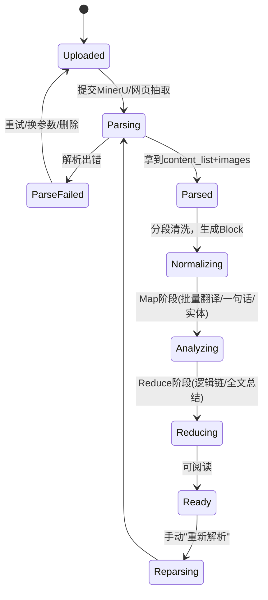
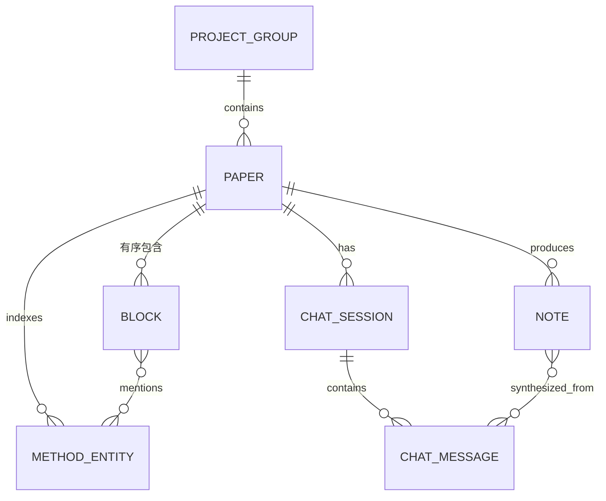
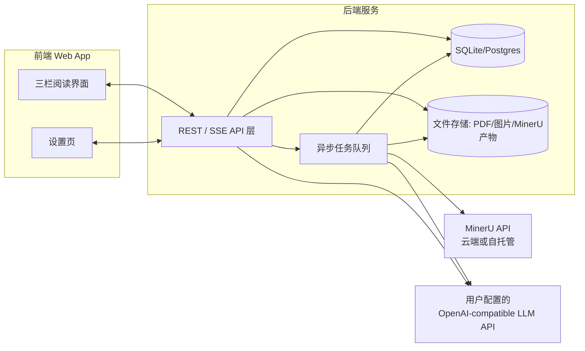

# 论文深度阅读工作台 · 产品与技术实现方案

> 工作代号建议：Paperico（可自定义，与你的 *Conditional Reaction Bench*、*MinerU.Chem* 形成统一的项目命名体系）
> 版本：v1.0　定位：**本文档面向负责实现该项目的 AI Coding Agent/ 开发者，是唯一权威的需求与验收依据**，请严格对照第 11 章逐项自查后再判定阶段完成。

---

## 0. 文档使用说明与关键假设

1. 本文档由你的原始需求（论文精读工作台的完整描述）梳理扩展而成。**凡是你原文明确提出的功能，均已 1:1 落到对应章节**；凡是我基于"化学信息学/机器学习论文阅读者的真实工作流"补充的内容，均在正文中以 **🔸建议** 标出，你可以在实现前逐一确认取舍。
2. 本文档中标注 **🔹假设** 的地方，是需求中未明确、但实现必须做出选择的技术决策（如技术栈、单用户模型等）。这些假设已经过合理性推敲，可直接执行；如需更改，只需替换对应章节，不影响整体架构。
3. 阅读顺序建议：第 1–3 章建立共同语言 → 第 4 章是功能"做什么" → 第 5–7 章是"怎么做"（数据 / 架构 / Prompt）→ 第 8–9 章是体验与质量红线 → 第 10 章是分期计划 → 第 11 章是验收清单（**开发每完成一个阶段，都应把该清单当作 Prompt 粘给自己/评审模型逐条自检**）。

**🔹核心假设（贯穿全文，如与你实际情况不符请优先调整这里）：**

| 假设项 | 内容 | 理由 |
|---|---|---|
| 使用场景 | 单用户 / 单租户"自带 Key"的在线工作台（Bring-Your-Own-Key），非多用户 SaaS | 你的描述聚焦个人科研阅读，未提及团队协作、权限、计费 |
| 部署形态 | 有后端服务的 Web App（而非纯前端静态站点） | 需要跑异步 MinerU 解析任务、持久化历史记录、代理调用 AI 接口而不把 Key 暴露在浏览器里 |
| 论文语种 | 原文默认英文，译文默认简体中文，但目标语言可在设置中更改 | 你的描述是"原文段落附中文译文" |
| 是否需要账号体系 | MVP 不做登录注册，本地/单实例数据隔离即可；如未来要多人使用，可在第 6 章的架构上平滑加一层用户表 | 降低第一阶段复杂度 |

---

## 1. 项目背景与设计原则

### 1.1 背景

你手上有两批论文：
- **Conditional Reaction Bench 相关**：同类技术背景 / 前沿论文，服务于你现有项目的持续调研；
  - /Users/juliusloon/Zotero/storage/L6NSN2VY/Ahneman et al. - 2018 - Predicting reaction performance in C–N cross-coupling using machine learning.pdf
    /Users/juliusloon/Zotero/storage/R4FUHQVJ/Perera et al. - 2018 - A platform for automated nanomole-scale reaction screening and micromole-scale synthesis in flow.pdf
    /Users/juliusloon/Zotero/storage/U49T8SVH/King-Smith et al. - 2024 - Probing the chemical ‘reactome’ with high-throughput experimentation data.pdf
    /Users/juliusloon/Zotero/storage/I7LJ5IWQ/Kearnes et al. - 2021 - The Open Reaction Database.pdf
    /Users/juliusloon/Zotero/storage/6E7DCWE8/Wigh et al. - 2024 - ORDerly Data Sets and Benchmarks for Chemical Reaction Data.pdf
    /Users/juliusloon/Zotero/storage/AVNWU2DV/Saebi et al. - 2023 - On the use of real-world datasets for reaction yield prediction.pdf
    /Users/juliusloon/Zotero/storage/TBWDA9BV/Schwaller et al. - 2021 - Prediction of chemical reaction yields using deep learning.pdf
    /Users/juliusloon/Zotero/storage/2C8UHG8N/Shen et al. - 2023 - Activity-cliff awareness enables robust graph learning for molecular property prediction.pdf
    /Users/juliusloon/Zotero/storage/9XHSWE4W/Zhang and MacMillan - 2017 - Direct Aldehyde C–H Arylation and Alkylation via the Combination of Nickel, Hydrogen Atom Transfer,.pdf
    /Users/juliusloon/Zotero/storage/62NU9HXV/Zhang et al. - 2023 - Activity Cliff Prediction Dataset and Benchmark.pdf
    /Users/juliusloon/Zotero/storage/U9HR5QLV/zotero-style.html
    /Users/juliusloon/Zotero/storage/EGYHDL42/aar5169-ahenman-sm_revision_1.pdf
    /Users/juliusloon/Zotero/storage/5E5JLSNQ/LLM-for-Zotero-MinerU-cache-L6NSN2VY.zip
    /Users/juliusloon/Zotero/storage/9AVK5RG6/LLM-for-Zotero-MinerU-cache-R4FUHQVJ.zip
    /Users/juliusloon/Zotero/storage/VP3Y5SZA/Das et al. - 2026 - A 50,688-Reaction Data Set Reveals General Ligands and Mechanistic Diversity in C–N Couplings.pdf

- **MinerU.Chem 相关**：一个新项目的技术实现原理论文。
  - /Users/juliusloon/Zotero/storage/A4KQPRKW/Yang et al. - 2026 - MinerU.Chem A High-Precision System for Optical Chemical Structure and Reaction Recognition.pdf
    /Users/juliusloon/Zotero/storage/LVM3I6EH/Wang et al. - 2026 - GTR-CoT Graph Traversal as Visual Chain of Thought for Molecular Structure Recognition.pdf
    /Users/juliusloon/Zotero/storage/8F293R2Z/Yang et al. - 2026 - MolRecBench-Wild A Real-World Benchmark for Optical Chemical Structure Recognition.pdf
    /Users/juliusloon/Zotero/storage/FZG4GRYM/Song et al. - 2026 - RxnCaption Reformulating Reaction Diagram Parsing as Visual Prompt Guided Captioning.pdf
    /Users/juliusloon/Zotero/storage/QC2GY7WM/Song et al. - 2026 - Molecular Identifier Visual Prompt and Verifiable Reinforcement Learning for Chemical Reaction Diagr.pdf


两批论文的共性需求是"**精读 + 理解 + 沉淀**"，而不是简单的翻译工具或摘要工具。因此本方案不是"做一个翻译网站"，而是把 **AI 拆解论文的能力 + 结构化可视化 + 有上下文记忆的对话 + 笔记沉淀** 整合成一个贴合科研精读思维的工作台，并做到与具体论文/项目解耦，可长期复用到你之后阅读的任何论文。

### 1.2 设计原则（贯穿所有模块的判断标准）

1. **内容为王，界面退居辅助**——三栏结构服务于"读—理解结构—提问—沉淀"这条主线，任何视觉元素若不服务于这条主线就应该被砍掉。
2. **AI 输出必须可溯源、反幻觉**——每一条一句话摘要、每一张方法卡片、Chat 里每一次对论文内容的引用，都必须能指回原文具体位置（block）；对论文未提及的内容，AI 必须明确声明，不得杜撰。
3. **一切可沉淀为 Obsidian 兼容 Markdown**——工作台产生的所有结构化理解（译文、逻辑链、方法索引、对话结论）最终都应该能以你个人知识库能识别的格式"带走"，工作台本身不是数据孤岛。
4. **增量处理、按需付费**——PDF 解析和 AI 分析都是要花钱花时间的资源，同一篇论文不应被重复解析/重复调用模型；用户能看到、能控制成本。
5. **自带密钥、数据自主**——LLM 与 MinerU 的 Key 由用户自己配置，后端只做透明转发与存储，不做二次代理售卖，不把论文内容发送到用户配置地址之外的任何第三方。

---

## 2. 核心用户旅程（User Journeys）

以下旅程是贯穿全文的验收基准，第 11 章的"端到端场景验收"直接对应这里。

**旅程 A · 精读一篇新论文（主线）**
上传 PDF 或粘贴链接 → 系统解析并展示处理进度 → 论文以三栏结构呈现，可切换看原文/译文 → 顺着左侧逻辑链导航快速建立全局认知 → 对不理解的段落/图表/方法发起提问 → 读完后勾选对话中有价值的部分 → 一键整理成笔记 → 导出为 Obsidian Markdown。

**旅程 B · 分项目管理两批论文**
新建"Conditional Reaction Bench"与"MinerU.Chem"两个项目分组 → 批量拖入/上传对应 PDF → 在历史列表按项目筛选、看处理状态 → 某天想回顾"我读过的论文里都用到了哪些表征方法"，进入跨论文方法索引查看。

**旅程 C · 首次使用配置**
进入设置页 → 填入 OpenAI-compatible 的 baseURL / apiKey / 模型 / 思考强度 → 填入 MinerU 的接入方式与 Key → 测试连接均成功 → 选一个主题色 → 开始使用。

**旅程 D · 论文间联动提问（🔸建议，衍生于你"最大化利用这些论文"的诉求）**
读到第 5 篇论文时，发现它和第 2 篇论文用的都是随机森林做产率预测 → 在方法索引页或 Chat 里直接发起"对比这两篇论文里 RF 的特征工程差异" → AI 基于两篇论文各自的结构化内容作答。

---

## 3. 信息架构与页面布局

### 3.1 整体骨架

顶部为全局条（项目/论文切换、全局搜索、处理状态、设置入口、明暗切换）；主体为三栏，左右两栏宽度固定、可折叠为图标栏，中间栏自适应剩余宽度；窄屏（平板及以下）三栏收起为顶部 Tab 切换（逻辑链 / 正文 / 信息与对话），🔸建议默认桌面端优先，移动端保证可用但不追求完全对等体验。

```
┌──────────────────────────────────────────────────────────────────────────┐
│ TopBar：[项目▾][论文▾]   🔍全局搜索        ⚙️设置   🌓主题   ●解析完成    │
├───────────────┬────────────────────────────────┬──────────────────────────┤
│ 左｜逻辑链导航  │        中｜正文阅读区            │  右上｜论文信息卡          │
│               │                                  │  标题/作者/年份/领域标签   │
│ ●┐ 摘要        │  【原文】Paragraph 1 ............ │  一句话总结 / 贡献点       │
│  │ 一句话       │  【译文】段落一的中文翻译 ......   ├──────────────────────────┤
│  │[RF][SAXS]    │                                  │  右下｜Chat 面板           │
│ ┊│              │  ┌────────────┐                  │  ┌────────────────────┐ │
│ ●┤ 引言          │  │   图 1      │                  │  │ 引用chip区(可叠加)  │ │
│  │ 一句话        │  │ 中文图注+要点│                  │  └────────────────────┘ │
│ ┊│              │  └────────────┘                  │  ...对话记录(流式)...     │
│ ●┤ 方法          │                                  │                          │
│  │[LR][贝叶斯优化]│  【原文】Paragraph 2 ............│  [总结全文][总结方法][亮点]│
│ ┊│              │  【译文】...                       │  [输入框.....][发送]      │
│ ●┘ 结果/讨论      │                                  │  [🖊 生成完整笔记]        │
└───────────────┴────────────────────────────────┴──────────────────────────┘
```

### 3.2 三栏内部结构

| 区域 | 组成 | 说明 |
|---|---|---|
| 左（约 22%，可折叠） | 密度切换（精简/详细）、搜索/按方法过滤、纵向节点列表 | 见 4.4 |
| 中（自适应） | 阅读控制条（原文/译文/双语切换、字号、分栏/堆叠）+ 正文流 | 见 4.2 |
| 右上（约 22% 高度自适应） | 论文元信息卡 | 见 4.5 |
| 右下（占满剩余高度） | Chat：引用 chip 区 → 消息流 → 预设 prompt 行 → 输入框 → 生成笔记入口 | 见 4.6 |

---

## 4. 功能模块详细设计

### 4.1 论文导入与解析（Ingestion）

**输入方式**
- PDF 上传：支持拖拽、多选批量（队列并行处理，互不阻塞）；
- 链接输入：
  - 若为 PDF 直链（含 arXiv `/pdf/xxxx` 这类可直接下载的地址）→ 自动走 **PDF + MinerU** 路径；
  - 若为普通网页（期刊 HTML 页/博客）→ 走**轻量网页正文抽取**路径（Readability 类算法取标题/正文/``），结构化程度低于 MinerU 路径，UI 需明确提示"网页解析模式，图表/公式还原度有限"；
  - 🔸建议：网页模式解析出的论文，若用户后续补传对应 PDF，系统应能"就地升级"为 MinerU 解析结果，而不是产生第二篇重复论文。

**处理状态机**



界面需要让用户看到自己处于状态机的哪一步（"解析中 68%"“正在提取方法实体”等），而不是一个笼统的转圈。

**MinerU 集成（🔹假设：优先云端 API，预留自托管开关）**

| 模式 | 说明 |
|---|---|
| 云端 API（默认） | Base URL 默认 `https://mineru.net/api/v4`，Bearer Token 鉴权（用户在 mineru.net 申请）。免运维、开箱即用。 |
| 自托管 / 私有部署 | 用户通过开源仓库（github.com/opendatalab/MinerU）或社区维护的 Docker 镜像自行部署解析服务，在设置页填自定义 Base URL（可选鉴权）。适合对论文数据敏感或需离线处理的场景。 |

处理流程（**字段与具体路径请以官方最新文档为准，下表为功能性描述**）：
1. 提交任务：PDF 直链可直接提交；本地上传文件遵循典型的"申请上传凭证 → 直传文件 → 提交任务"两段式流程。可配置项：`is_ocr`、`enable_formula`、`enable_table`、`language`、`page_ranges`、`model`（`pipeline` 速度优先 / `vlm` 精度优先，官方数据约 90%+ 准确率）、`extra_formats`（如需附带导出 docx/html/latex）。
2. 轮询任务状态（`task_id`），完成后返回结果压缩包下载地址。
3. 拉取结果：`*.md`（全文 Markdown）、`content_list.json`（结构化区块数组）、`images/`（抽取图片）。
4. 限制：单文件建议 ≤200MB、≤600 页；单次批量导入建议 ≤200 个文件/链接；具体配额随账号套餐浮动，导入前应在设置页展示当前额度（若接口暴露该信息）。

`content_list.json` → 内部 Block 的映射（示意，联调时以真实返回为准）：

| MinerU 字段（典型） | 含义 | 映射到内部 Block |
|---|---|---|
| `type` | text / title / image / table / equation | → `kind` |
| `text` | 文本内容 / 图注 / 表注 | → `textOriginal` / `captionOriginal` |
| `text_level` | 标题层级（0=正文，1=H1…） | → 判定 `kind=section_heading` 及章节层级 |
| `img_path` | 图片相对路径 | → `imagePath` |
| `table_body` | 表格 HTML/文本 | → `tableHtml` |
| `page_idx` | 页码 | → `pageIdx` |
| `bbox` | 版面坐标 | → `bbox`（用于"跳转原文位置"等增强交互） |

MinerU 官方已在解析阶段去除页眉页脚页码等噪声并保持阅读顺序，因此第 4.1 之后的"分段清洗"只需做防御性二次过滤（如极短重复行），不必重造轮子。

**🎯 关键验收点**：一篇 10–30 页、含图表的英文 PDF 能在设置的参数下无人工干预跑通到 Ready；解析失败给出明确原因与重试/删除入口；批量导入互不阻塞。

---

### 4.2 双语对照排版（Bilingual Reading Layout）

- 每个 Block（段落/列表项/小标题）原文下方紧跟中文译文，专业术语首次出现保留英文原词并括注中译（如"随机森林（Random Forest, RF）"）；公式、化合物代号、数据集专名不译。
- 阅读控制条：原文/译文/双语三态切换、字号、"堆叠显示"与"并排双栏"两种排版、行高。
- 图表：原图 + 原始英文图注 + 中文图注 + AI 提炼的核心要点（见 4.3），大图可点击放大；表格若 MinerU 返回结构化数据则渲染为真表格而非贴图,并支持简单排序；退化情形（网页抽取路径无结构化表格）显示图片+AI摘要。
- 公式：LaTeX 用 KaTeX 原样渲染，下方追加一行 AI 生成的中文大白话解释（🔸建议——公式对精读者往往是最大的理解门槛，值得单独产出一条"人话翻译"）。
- 每个 Block 拥有稳定 `id`，作为左侧导航联动、划词入 Chat、笔记引用的锚点。

**🎯 关键验收点**：关闭译文开关只隐藏不丢数据；公式正确渲染且有中文解释；结构化表格优先于图片贴图。

---

### 4.3 AI 全文分析引擎（Analysis Engine）

处理管线采用 **Map-Reduce**：先对每个 Block 做便宜的"局部"处理（可并行分批），再用一次"压缩后"的全局调用重建逻辑链与总结——避免把整篇论文原文塞进每一次调用，从而控制长文档的上下文与费用（长文档处理策略详见 6.4；具体 Prompt 见第 7 章）。

**Map 阶段（按 Block 批处理，见 7.2）**：
- 翻译（zh）
- 一句话摘要 + 关键词（服务于左侧导航）
- 核心方法/实体识别与归类（见下表分类法）
- 图表单独走一次多模态调用（见 7.3）：图表类型判定 + 核心要点 + 数据解读提示

**Reduce 阶段（对压缩后的"一句话序列 + 实体去重表"做一次全局调用，见 7.4）**：
- 全文逻辑链（叙事角色标注：提出问题/方法设计/关键结果/局限讨论…）
- 全文总结（问题→方法→结果→结论的连贯叙事，而非逐段罗列）
- 3–5 条核心贡献点、领域标签、难度评估

**核心方法/实体分类法**（🔸建议——把你举例的 LR / RF / SAXS 系统化为可过滤、可跨论文聚合的分类体系）：

| 类别 | 说明 | 示例 |
|---|---|---|
| `ML_MODEL` | 机器学习模型/架构 | Random Forest、GNN、Transformer |
| `ALGORITHM` | 算法/优化方法 | 贝叶斯优化、遗传算法 |
| `INSTRUMENT_METHOD` | 表征/检测/分析方法 | SAXS、NMR、HPLC、XRD |
| `DATASET_BENCHMARK` | 数据集/基准/数据库 | USPTO-50k、ORD |
| `METRIC` | 评价指标 | R²、F1、Yield % |
| `CHEMISTRY` | 反应类型/试剂/催化剂 | Suzuki 偶联、Pd 催化剂 |
| `SOFTWARE_TOOL` | 软件/框架/工具 | RDKit、PyTorch |
| `OTHER` | 兜底 | — |

**反幻觉要求**：每条实体、每条一句话必须携带来源 `block_id`；Reduce 阶段严禁引入 Map 阶段完全没出现过的实体或数据。

**🎯 关键验收点**：抽取的方法/实体点击可回跳原文出处；全文总结读起来是一段连贯叙事而非"第1段讲了…第2段讲了…"的堆砌。

---

### 4.4 左侧逻辑链导航（Left Panel）

这是你需求里描述最具体的部分，按你的描述固化为组件规范：

- **结构**：纵向 stepper。每个节点 = `● 圆点锚点`（对应该 Block 起始位置）+ 下方 `一句话/关键词` + 再下方 `核心方法卡片行`；节点之间以**虚线**连接。
- **节点类型**：文本段落、图、表、公式、小节标题分别有区分图标（如 §/🖼/▦/∑/●），一眼能看出这是文字还是图表节点。
- **交互**：
  - 点击节点 → 中间栏平滑滚动到对应 Block 并短暂高亮；
  - 中间栏滚动 → 基于 IntersectionObserver 的 scrollspy，自动高亮左侧当前所在节点；
  - 点击方法卡片 → 高亮/列出该实体在全文出现的所有节点（同时也是 4.6 里"点击卡片填入对话"的触发源）。
- **密度切换**：精简（只显示圆点+一句话）／详细（含方法卡片）；🔸建议再加一个"仅看含某方法的节点"的过滤开关，便于长论文里快速定位某个方法反复出现的位置。
- **顶部小导航**（🔸建议）：可折叠的章节树（基于 `section_heading` 层级），用于超长论文里的"跳到某一大节"。

**🎯 关键验收点**：节点数量与正文段落+图表数量一致（因合并短段落产生的偏差需可解释）；点击/滚动双向联动；虚线-圆点-一句话-卡片四层结构清晰可辨。

---

### 4.5 右上·论文信息卡（Meta Card）

字段：标题（原文+中译）、作者、年份/来源期刊或会议、原始链接/文件名、领域标签（多个彩色 chip）、AI 一段话总结（对应 Reduce 阶段的 `narrative_summary`）、核心贡献点（3–5 条）、难度估计、所属项目分组徽标、处理状态、上次打开时间。🔸建议加"预计阅读时长"（按正文字数粗算，纯前端计算即可，无需模型参与）。

所有 AI 抽取字段均可编辑修正（标题识别出错是 PDF 解析的常见问题，需要人工兜底）。

**🎯 关键验收点**：字段完整且可编辑；领域标签/项目徽标与 4.8 的项目管理联动一致。

---

### 4.6 右下·Chatbot 面板（Contextual Chat）

**上下文装配策略**：系统提示中默认注入"论文元信息 + 压缩版逻辑链 + 方法索引"，**不默认注入全文原文**（控制 token 成本）；当用户通过下列方式显式引用某段/某图/某实体时，该内容的完整文本/图片才作为本轮附加上下文发送。🔸建议 v1.5 起加入基于关键词或向量检索的兜底召回：当问题明显需要具体原文佐证、但用户没有手动引用任何内容时，自动检索相关 Block 补充进上下文，而不是让模型凭空回答。

**快捷引用交互（对应你需求中的三种点选方式）**：
1. **划词入对话**：在正文选中任意文字 → 悬浮出现"＋加入对话"按钮 → 输入框顶部生成可删除的引用 chip（带来源 `block_id`），真正发送时把该段原文作为附加上下文。
2. **方法卡片入对话**：点击左侧或正文中的方法卡片 → 生成引用 chip，附带上下文为该实体的定义 + 全部出处 Block。
3. **图表入对话**：点击图/表 → 生成带缩略图的引用 chip；发送时把图片作为图片内容块（若模型支持视觉输入）连同 AI 摘要文本一起发送，兼顾"看图"与"文字兜底"。
4. 多个 chip 可在同一条消息里叠加，支持"结合这段文字和这张图，说说……"这类复合提问。

**预设 Prompt（输入框上方）**：内置「总结全文」「总结方法」「亮点与创新点」三项（对应你原文），并 🔸建议默认追加「局限与未来方向」「提取实验设置与数据集」「与项目内其他论文对比」「生成自测思考题」「换一种更通俗的说法解释」。全部可在设置页增删改排序。点击后填充模板到输入框（可与当前已挂的引用 chip 组合成一条问题），默认"填充等待用户确认发送"而非自动发送。

**消息级操作**：复制（见 4.7）、重新生成、"标记为笔记候选"、点击回复中的 `[bxxxx]` 来源标注可跳转正文对应位置。

**"整理成笔记"流程**（对应你需求中的收尾功能）：
1. 用户在对话历史中勾选任意消息（不要求连续）；
2. 点击「生成完整笔记」→ 调用笔记整理 Prompt（见 7.5），把勾选内容 + 论文结构化数据重新组织成一篇连贯笔记，而非简单拼接问答；
3. 预览/编辑（可编辑的 Markdown 区）；
4. 导出为 `.md` 文件下载，同时作为 `Note` 对象持久化在该论文历史中，可反复查看/再编辑。

**🎯 关键验收点**：三种引用方式均能验证真实进入了发给模型的上下文（可通过请求体核查）；预设 prompt 与引用 chip 可组合；回复中论文相关内容带 `[bxxxx]` 溯源标注；未提及内容时模型明确声明"未提及"。

---

### 4.7 Obsidian Markdown 复制规范（Copy Format）

对话中每条 AI 回复的"复制"按钮，输出经过格式化的 **Obsidian 兼容、LaTeX 兼容** Markdown，规则如下：

| 规则 | 说明 |
|---|---|
| 数学公式 | 仅使用 `$...$`（行内）与 `$$...$$`（块级），不使用 `\( \)` `\[ \]`（Obsidian 默认渲染器对后者支持不稳定） |
| Wikilink | 已识别的方法实体名、论文标题自动包裹为 `[[名称]]`，便于 Obsidian 自动建立双链图谱；设置页可整体开关 |
| Callout | 🔸建议对"亮点/结论"类内容用 `> [!tip]`，"局限/风险"类用 `> [!warning]`，"引用论文原句"类用 `> [!quote]` |
| 代码/公式块 | 代码使用带语言标注的三反引号围栏；避免破坏 Markdown 语法的残留 HTML 标签 |
| 表格 | 注意单元格内竖线 `\|` 转义 |

「生成完整笔记」导出的笔记额外带 **YAML frontmatter**（模板与生成方式见 7.5），使其在 Obsidian 中自动携带标题、来源、项目、标签等元数据，可被 Dataview 等插件检索。

**🎯 关键验收点**：复制内容粘贴进 Obsidian 后公式正常渲染、wikilink 可点击、无格式错乱（建议人工在 Obsidian 中实抽查）。

---

### 4.8 项目与历史管理（Projects & History）

- **项目分组**：`ProjectGroup`（如 "Conditional Reaction Bench" "MinerU.Chem"，可自建更多）包含多篇论文；论文卡片展示封面缩略图、标题、状态（待解析/解析中/已就绪/已读/出错）、标签、加入时间、最近打开时间，支持打开/重新解析/删除/转移项目/单独导出。
- **搜索与筛选**：按项目/标签/状态筛选；全文关键词搜索（MVP 用关键词匹配，🔸建议 v2 升级为向量语义搜索，见 6.4）。
- **批量导入**：多文件排队并行处理。
- **跨论文方法/术语索引**（🔸建议，呼应你"最大化利用这些论文"的诉求）：一个独立页面，列出某个项目（或全局）内所有出现过的方法实体，按 4.3 的分类聚合，每个词条显示 AI 综合多篇论文生成的统一释义 + 出现过的论文与位置列表。这本质上是精读过程沉淀下来的"活词典"，也天然对应 Obsidian 里方法名 wikilink 指向的"母页面"内容来源。

**🎯 关键验收点**：新建两个项目分组后论文能正确归类筛选；搜索一个方法名能返回所有命中论文与定位；跨论文索引页可用。

---

### 4.9 设置页面（Settings）

| 分区 | 内容 |
|---|---|
| **AI 模型配置** | 支持多个 *Model Profile*（如"默认""翻译与提取(轻量)""深度分析与对话(强)"）；每个 Profile 含 `baseURL`/`apiKey`（脱敏展示）/`model`/`temperature`/`max_tokens`/**思考强度**（`off/low/medium/high` 归一化枚举 + 可选数值 `reasoning_budget_tokens` + 高级原始 JSON 透传，兼容 OpenAI 系 `reasoning_effort`、Anthropic 系 `thinking.budget_tokens`/`effort`、Gemini 系 `thinking_level` 等不同厂商的实现差异）/是否流式；🔸建议可将不同 Profile 指派给不同处理阶段（翻译提取用便宜模型、逻辑链与对话用强模型），降本增效 |
| **MinerU 配置** | 模式（云端/自托管）、baseURL、apiKey/token、默认解析参数（OCR/公式/表格识别开关、语言、`pipeline`/`vlm` 后端选择） |
| **外观** | 主题强调色（预设色板 + 自定义色值）、明暗模式、正文字号、双语默认展示方式；基础色始终为黑白灰中性色阶，强调色仅用于交互态与强调元素 |
| **对话与笔记** | 预设 prompt 的增删改排序、默认目标翻译语言、Wikilink 开关、笔记 frontmatter 模板字段自定义 |
| **数据与隐私** | 存储位置说明、缓存清理、全量备份导入导出（JSON）、按论文的 Token 用量与费用估算看板（🔸建议）、删除全部数据 |
| **连接测试** | LLM 与 MinerU 各自的"测试连接"按钮，做一次轻量 ping 调用并展示成功/失败原因 |

**🎯 关键验收点**：至少一个 LLM Profile 与 MinerU 均可配置并测试通过；主题色变更只影响交互元素、不破坏黑白灰基调；apiKey 默认掩码且不出现在对第三方的请求中。

---

### 4.10 补充建议功能一览

以下是在你原始需求之外新增的建议项，已分散标注在相应章节中，此处汇总方便你整体取舍：

| 建议功能 | 价值 | 已在章节 | 建议阶段 |
|---|---|---|---|
| 跨论文方法/术语活词典 | 把碎片化的方法认知沉淀为可复用的领域词典 | 4.8 | Phase 1.5 |
| 论文间联动对比提问 | 契合"两批同类论文"场景，发挥聚合价值 | 2 (旅程D) / 4.6 | Phase 1.5 |
| 划线批注与颜色标签 | 精读时标记疑问/重点/待复现，独立于 AI 摘要 | 8.2（组件）| Phase 2 |
| Token 用量与成本看板 | 自带 Key 场景下用户对花费有知情权 | 4.9 | Phase 1.5 |
| Prompt 模板可编辑 | 不同论文类型（化学合成 vs 模型架构）需要的抽取侧重不同 | 4.9 / 7 | Phase 2 |
| 化学结构识别（图转 SMILES） | 直接命中你的化学信息学场景，反应式/分子结构图可被结构化 | 9（路线图）| Phase 2（探索性） |
| 生成自测思考题 | 学习场景下的主动回忆，比单纯阅读记得更牢 | 4.6 预设prompt | Phase 1 |
| 网页解析"升级"为 PDF+MinerU | 避免同一篇论文产生两份质量不一致的记录 | 4.1 | Phase 1.5 |

---

## 5. 数据模型（Data Model）

> 说明：左侧逻辑链导航**不单独建表**，而是对 `Block` 数组按 `order` 排序后直接渲染（`oneLiner`/`roleInNarrative`/`entityRefs` 已挂在 Block 上），避免数据冗余。



```typescript
type BlockKind = "section_heading" | "paragraph" | "list_item" | "figure" | "table" | "equation";
type EntityCategory = "ML_MODEL" | "ALGORITHM" | "INSTRUMENT_METHOD" | "DATASET_BENCHMARK" | "METRIC" | "CHEMISTRY" | "SOFTWARE_TOOL" | "OTHER";

interface Paper {
  id: string;
  projectId: string;
  title: string;
  titleZh?: string;
  authors: string[];
  year?: number;
  venue?: string;
  sourceType: "pdf_upload" | "url_pdf" | "url_html";
  sourceUrl?: string;
  originalFileName?: string;
  domainTags: string[];
  tlDr?: string;                 // 一句话总结
  narrativeSummary?: string;     // Reduce阶段生成的全文逻辑总结
  contributions?: string[];
  difficultyEstimate?: "入门" | "中等" | "较难";
  status: "uploaded" | "parsing" | "parsed" | "normalizing" | "analyzing" | "reducing" | "ready" | "error";
  errorMessage?: string;
  readingProgress: number;       // 0-1
  mineruTaskId?: string;
  createdAt: string;
  updatedAt: string;
  lastOpenedAt?: string;
}

interface Block {
  id: string;                    // "b0001"
  paperId: string;
  order: number;
  kind: BlockKind;
  pageIdx?: number;
  bbox?: [number, number, number, number];
  sectionTitle?: string;         // 最近祖先标题
  // 文本类
  textOriginal?: string;
  textZh?: string;
  oneLiner?: string;
  keywords?: string[];
  roleInNarrative?: string;      // 来自Reduce阶段
  // 图/表类
  imagePath?: string;
  captionOriginal?: string;
  captionZh?: string;
  figureType?: string;           // line_chart/reaction_scheme/molecule_structure/...
  coreTakeaways?: string[];
  dataReadingNotes?: string;
  tableHtml?: string;
  // 公式类
  latex?: string;
  plainExplanation?: string;
  entityRefs: string[];          // 关联的MethodEntity id
}

interface MethodEntity {
  id: string;
  paperId: string;
  canonicalKey: string;          // 跨论文去重用的归一化key，如 "random_forest"
  name: string;                  // "Random Forest (RF)"
  category: EntityCategory;
  definitionZh?: string;         // AI综合生成的释义（可懒加载）
  blockRefs: string[];           // 出现的block id，按顺序
}

interface ChatMessage {
  id: string;
  sessionId: string;
  role: "user" | "assistant";
  content: string;
  attachedContext?: Array<{
    type: "text_selection" | "method_card" | "figure" | "preset_prompt";
    refBlockId?: string;
    refEntityId?: string;
    snippet?: string;
  }>;
  citedBlockIds?: string[];      // 从assistant回复中解析出的[bxxxx]引用
  createdAt: string;
}

interface ChatSession {
  id: string;
  paperId: string;
  title?: string;
  messages: ChatMessage[];
  createdAt: string;
}

interface Note {
  id: string;
  paperId: string;
  title: string;
  markdownContent: string;       // 含frontmatter，Obsidian风格
  sourceMessageIds: string[];
  createdAt: string;
  updatedAt: string;
}

interface ProjectGroup {
  id: string;
  name: string;                  // "Conditional Reaction Bench" / "MinerU.Chem" / 自定义
  description?: string;
  colorTag?: string;
  paperIds: string[];
  createdAt: string;
}

interface ModelProfile {
  id: string;
  name: string;
  baseUrl: string;
  apiKey: string;                 // 静态加密存储
  model: string;
  temperature?: number;
  maxTokens?: number;
  reasoningEffort?: "off" | "low" | "medium" | "high";
  reasoningBudgetTokens?: number;
  extraParamsJson?: string;       // 高级原始参数透传
  streaming: boolean;
}

interface AppSettings {
  modelProfiles: ModelProfile[];
  profileAssignment: {
    translationAndExtraction: string;  // ModelProfile.id
    logicChainAndSummary: string;
    figureVision: string;
    chat: string;
    noteSynthesis: string;
  };
  mineru: {
    mode: "cloud" | "self_hosted";
    baseUrl: string;               // 默认 https://mineru.net/api/v4
    apiKey: string;
    defaultOptions: {
      isOcr: boolean;
      enableFormula: boolean;
      enableTable: boolean;
      language: string;
      modelBackend: "pipeline" | "vlm";
    };
  };
  appearance: {
    accentColor: string;           // hex
    themeMode: "light" | "dark" | "system";
    readingFontSize: number;
    bilingualLayout: "stacked" | "side_by_side";
  };
  chatDefaults: {
    presetPrompts: Array<{ label: string; template: string }>;
    targetLanguage: string;        // 默认 "zh-CN"
    enableWikilinks: boolean;
  };
}
```

---

## 6. 系统架构与技术栈

### 6.1 推荐技术栈（🔹假设：推荐默认，可替换，但下方设计以此为准）

| 层 | 推荐 | 理由 |
|---|---|---|
| 前端 | React + TypeScript + Vite + Tailwind CSS，状态用 Zustand，Markdown+公式渲染用 `react-markdown` + `remark-math`/`rehype-katex` | 生态成熟，公式/Markdown渲染方案现成 |
| 后端 | Python + FastAPI | 与 MinerU 生态（本身 Python）联调最省心，异步任务、SSE 流式回复都原生支持 |
| 数据库 | SQLite（单实例够用）起步，预留切换 Postgres 的空间 | 单用户场景无需引入运维成本 |
| 任务队列 | 轻量方案：FastAPI 自带的 `BackgroundTasks` 或进程内队列起步；论文量大后可换 Celery/RQ + Redis | 先跑通、后扩展 |
| 文件存储 | 本地磁盘（原始 PDF、MinerU 产物、图片） | 单实例场景足够，可平滑迁移对象存储 |
| 鉴权/安全 | apiKey 落库前用对称加密（如 Fernet），返回给前端时脱敏 | 自带 Key 场景下密钥安全是硬性要求 |

### 6.2 架构总览



后端对 LLM/MinerU 的调用**是纯转发+编排**，不落地明文 Key 到日志，不把论文内容发往用户配置地址之外的任何服务。

### 6.3 API 一览

| 方法 | 路径 | 说明 |
|---|---|---|
| POST | `/api/projects` | 新建项目分组 |
| GET | `/api/projects` | 项目分组列表 |
| POST | `/api/papers` | 上传 PDF 或提交 URL，创建论文记录并入队 |
| GET | `/api/papers` | 论文列表（按 project/tag/status 筛选、关键词搜索） |
| GET | `/api/papers/:id` | 获取论文完整结构化内容（blocks/entities/meta） |
| GET | `/api/papers/:id/status` | 轮询处理状态（或 SSE 推送） |
| POST | `/api/papers/:id/reparse` | 用新参数重新解析 |
| POST | `/api/papers/:id/retranslate` | 复用已解析结构，重跑翻译与全文逻辑链 |
| DELETE | `/api/papers/:id` | 删除论文及关联数据 |
| POST | `/api/papers/:id/chat` | 发送对话消息（SSE 流式返回） |
| GET | `/api/papers/:id/chat/:sessionId` | 获取会话历史 |
| POST | `/api/papers/:id/notes/synthesize` | 依据所选消息生成整理笔记 |
| GET | `/api/papers/:id/notes` | 该论文下的笔记列表 |
| GET | `/api/library/methods` | 跨论文方法/术语索引（可按项目过滤） |
| GET / PUT | `/api/settings` | 读取/更新设置（敏感字段脱敏返回） |
| POST | `/api/settings/test-llm` | 测试 LLM 连通性 |
| POST | `/api/settings/test-mineru` | 测试 MinerU 连通性 |

### 6.4 长文档的 Map-Reduce 策略（关键工程决策）

一篇 15–30 页的论文可能拆解出 150–400 个 Block，逐块单独调用 LLM 既慢又贵。因此：
- **Map 阶段**：把 Block 按 15–25 个一批打包（保留论文标题/摘要作为每批的共享上下文），单次调用同时产出翻译+一句话+实体（见 7.2），而不是三次独立调用；图表因为要读图，单独按张调用（见 7.3）。
- **Reduce 阶段**：不把全文原文喂给模型，只把"Block 顺序 + 一句话 + 已去重实体表"这份体积小得多的压缩表示喂给模型来重建逻辑链和总结（见 7.4）——这是让"任意长度论文"都能在可控上下文和成本下完成全文级理解的核心手段。
- **实体去重**：Map 阶段各批次产出的原始实体提及先按 `canonicalKey`（名称归一化，如去除大小写/缩写映射）做规则去重，规则无法判定的模糊情况（如"the model" vs "our RF model"）再交给一次轻量 LLM 判定是否为同一实体。

### 6.5 可靠性与并发

- 每个处理阶段的产物独立落库，某一阶段失败（如 Reduce 调用超时）不需要从头重跑 Map 阶段，支持"从失败点续跑"；
- LLM/MinerU 调用统一走带指数退避的重试；
- 批量导入时对下游 API 做并发度限流，避免触发用户自己 Key 的速率限制。

---

## 7. AI Prompt 设计蓝图

> 以下均为可直接落地的 Prompt 草案，`{{...}}` 为运行时填充变量。示例输出结构中的 `//` 注释仅为说明用途，实际要求模型输出**合法 JSON，不含注释与多余文字**。

### 7.1 分段清洗（规则为主，非必须调用 LLM）

- 依据 `text_level`/`type` 构建章节层级；
- 合并明显属于同一段被 MinerU 拆开的连续短文本（无终止标点结尾 + 下一块无标题打断）；
- 二次防御性过滤残留的页眉页脚/纯页码噪声；
- 分配稳定的 `block_id`（如 `b0001` 递增）。

### 7.2 翻译 + 一句话摘要 + 实体抽取（Map 阶段，合并为单次调用）

```text
System:
你是一名同时精通化学信息学（Cheminformatics）与机器学习的科研助理，正在协助用户逐段精读一篇英文学术论文。
你的任务：对给定的若干"文本块"，逐块完成下列四件事，只输出规定的JSON，不要输出任何其他文字。

对每个块输出：
1. translation：忠实、专业、流畅的简体中文翻译。专业术语首次出现时保留英文原词并括注中译，如"随机森林（Random Forest, RF）"。公式、变量名、化合物代号、数据集/数据库专名一律保留英文原文不译。
2. one_liner：一句话（不超过30个汉字）概括该块核心内容，用于左侧目录导航,要求具体可区分，避免"介绍了背景"这类空泛表述。
3. keywords：0-3个能代表该块内容的关键词。
4. entities：从该块中识别出的"核心方法/实体"提及，每个包含：
   - name：实体名称（有缩写则写"全称（缩写）"，如"Small-Angle X-ray Scattering (SAXS)"）
   - category：从["ML_MODEL","ALGORITHM","INSTRUMENT_METHOD","DATASET_BENCHMARK","METRIC","CHEMISTRY","SOFTWARE_TOOL","OTHER"]中选择最贴切的一个
   - mention_context：该实体在本块中出现的原文短句（≤20词），用于溯源

只对确有明确出现的方法/实体输出，不要臆造或过度泛化（例如不要把"machine learning"本身当作实体，除非全文并未指明具体模型）。

论文标题与摘要（仅用于理解上下文，不需要翻译）：
{{paper_title_and_abstract}}

输出格式（严格JSON数组，与输入块一一对应，顺序一致）：
[
  {
    "block_id": "b0001",
    "translation": "...",
    "one_liner": "...",
    "keywords": ["..."],
    "entities": [{"name": "...", "category": "ML_MODEL", "mention_context": "..."}]
  }
]

User:
待处理文本块（kind为figure/table/equation时text为其原始caption及紧邻说明文字）：
{{blocks_batch_json}}
```

### 7.3 图表摘要（多模态调用，逐张图/表）

```text
System:
你是一名科研图表解读助手。你会收到一张来自学术论文的图片（图/表截图）、其原始英文图注，以及图注前后紧邻的正文片段作为上下文。

请输出严格JSON：
{
  "figure_type": "line_chart | bar_chart | scatter | reaction_scheme | molecule_structure | workflow_diagram | microscopy_image | spectrum | table_data | other",
  "caption_zh": "图注的中文翻译",
  "core_takeaways": ["要点1（一句话，≤40字）", "要点2", "要点3（最多3条）"],
  "data_reading_notes": "若为图表/曲线/表格，用1-2句话说明坐标轴/关键列含义及应重点关注的趋势或对比；若为反应式或结构图，说明反应物→产物或结构要点",
  "entities": [{"name": "...", "category": "..."}]
}

只依据图片与提供文本作答，不得编造图中不存在的数据；若图像细节不足以确认精确数值，请如实说明。

图注（原文）：{{caption_en}}
上下文（原文，图注前后各1-2段）：{{surrounding_text}}
[图片附件]
```

### 7.4 逻辑链与全文总结（Reduce 阶段）

```text
System:
你是一名论文精读教练。你将收到一篇论文按原文顺序排列的"一句话摘要"列表（而非全文原文）、论文标题与摘要、以及已去重的方法实体列表。请基于这些压缩后的线索，重建全文的逻辑链条与整体叙事，输出严格JSON：

{
  "narrative_summary": "200-350字的连贯中文总结，按'问题/动机→方法/思路→关键实验或推导→结果→结论与意义'的叙事顺序撰写，讲清楚'为什么这样做、怎么做、发现了什么'这条主线，不要逐段罗列",
  "contributions": ["贡献点1", "贡献点2"],
  "domain_tags": ["..."],
  "difficulty_estimate": "入门 | 中等 | 较难",
  "logic_chain": [
    {"block_id": "b0001", "section": "所属章节标题（若能判断）", "role_in_narrative": "该节点在整体逻辑中的角色，如'提出问题''方法设计''关键结果''局限性讨论'"}
  ]
}

logic_chain数组必须与输入的一句话列表一一对应、顺序一致，只新增role_in_narrative字段。

输入：
论文标题/摘要：{{title_abstract}}
去重后的方法实体列表：{{deduped_entities}}
按顺序排列的节点列表（block_id, kind, one_liner, section_guess）：{{ordered_one_liners}}
```

### 7.5 Chat 系统提示

```text
System:
你是本工作台内嵌的论文精读助手，用户正在阅读以下论文：

【论文元信息】
标题：{{title}} / {{title_zh}}
领域标签：{{domain_tags}}
一句话总结：{{tl_dr}}

【全文逻辑链（压缩版，按原文顺序）】
{{logic_chain_compact}}   // 形如：[b0003] 引言-提出问题：现有方法难以...

【已识别方法/实体索引】
{{method_index_compact}}  // 形如：RF(随机森林,ML_MODEL)→出现于 b0012,b0045,b0071

【本轮用户手动附带的上下文】（可能为空）
{{attached_context}}

回答要求：
1. 默认使用简体中文回答；专业术语、模型名、数据集名等保留英文原词。
2. 回答必须基于以上论文内容；若问题的答案在论文中未被提及，必须明确说明"论文原文未提及/未讨论此问题"，禁止编造论文中不存在的内容或数据。
3. 引用论文具体内容时，在句末以"[b00xx]"标注来源block_id（仅标注确实来自该块的内容），便于用户点击溯源。
4. 数学公式使用$...$（行内）与$$...$$（块级），兼容Obsidian渲染，不使用\( \)或\[ \]。
5. 若问题明显超出本论文范围，可基于通用知识补充回答，但需明确区分"论文内容"与"补充知识"两部分。
```

### 7.6 笔记整理（Note Synthesis）

```text
System:
你是一名帮助用户把"论文阅读过程中的问答与要点"整理成可长期保存的知识笔记的助手。

输入包括：
1. 论文元信息（标题、作者、年份、来源、领域标签）
2. 全文逻辑链与方法索引（结构化数据）
3. 用户在对话中选中、希望被纳入笔记的若干轮问答（按时间顺序，可能碎片化、跳跃式）

请输出一篇结构清晰、去重、语言连贯的Markdown笔记（而非把问答简单拼接），要求：
- 使用YAML frontmatter记录元信息（模板见下）
- 按"核心结论先行、细节展开在后"的原则组织内容，可自行归纳合适的二级标题（如背景与问题、核心方法、关键结果、局限与展望、我的疑问与思考等），不必强套固定模板，以内容本身逻辑为准
- 用户在问答中记录的"个人思考/疑问/后续TODO"，单独保留在末尾"个人笔记"区块，不与论文客观内容混写
- 已知的方法实体名称与论文标题用[[双方括号]]包裹作为Obsidian双链
- 数学公式使用$ $ / $$ $$，代码使用带语言标注的代码块
- 不得虚构问答与结构化数据中都未出现的内容

YAML frontmatter模板：
---
title: "{{paper_title_zh}}"
title_original: "{{paper_title}}"
source: "{{source_url_or_file}}"
authors: [{{authors}}]
year: {{year}}
project: "{{project_group_name}}"
domain_tags: [{{domain_tags}}]
status: "已读"
created: "{{iso_date}}"
tags: ["paper-note", {{extra_tags}}]
---

输入数据：
{{structured_context_json}}
```

### 7.7 Obsidian 格式后处理（确定性代码逻辑，非 AI 调用）

作为对 7.5/7.6 输出格式合规性的兜底，不完全依赖模型自觉遵守格式约定：
- 校验并修复公式定界符（把误用的 `\( \)`/`\[ \]` 转换为 `$ $`/`$$ $$`）；
- 校验 YAML frontmatter 是否合法可解析；
- 对已知的方法实体名 / 论文标题做字符串匹配（大小写不敏感、最长匹配优先），自动补齐遗漏的 `[[wikilink]]`；
- 校验代码围栏是否闭合。

---

## 8. 视觉与交互设计规范

### 8.1 设计令牌（Design Tokens）

```css
/* 中性色阶：始终是界面主体 */
--gray-0:   #ffffff;
--gray-50:  #f7f7f7;
--gray-100: #ececec;
--gray-200: #dedede;
--gray-300: #c4c4c4;
--gray-400: #9a9a9a;
--gray-500: #717171;
--gray-600: #525252;
--gray-700: #383838;
--gray-800: #222222;
--gray-900: #121212;

/* 强调色：仅用于交互/强调元素，设置页可配置，示例默认值 */
--accent: #2F6FED;
--accent-soft: color-mix(in srgb, var(--accent) 12%, white);
```

**强调色使用铁律**：只用于左侧节点激活态、卡片 hover 边框、主操作按钮、链接、进度指示；**绝不用作大面积背景填充**，以维持"干净"的黑白灰基调。深色模式下中性色阶整体反转，强调色保持色相、按需调整明度以保证对比度。

### 8.2 关键组件

| 组件 | 要点 |
|---|---|
| 方法卡片 | 名称 + 类别小图标/色点，hover 展示简短释义，点击注入 Chat |
| 逻辑链节点 | 圆点锚点 + 虚线连接（`border-style: dashed`），当前态用强调色填充圆点 |
| 图表块 | 图片 + 中文图注 + AI 要点 callout，hover 出现"加入对话"按钮 |
| Chat 气泡 | 支持 Markdown+KaTeX 渲染，来源标注 `[bxxxx]` 可点击 |
| 引用 chip | 输入框上方，带类型图标（文字/卡片/图表）与删除按钮 |

### 8.3 排版与动效

- UI 采用系统无衬线字体（如 Inter / -apple-system）；中间栏正文与译文建议使用更适合长时间阅读的衬线/宋体（如 Source Serif 4 / Noto Serif SC），与 UI 字体形成"阅读区 vs 操作区"的视觉区分；方法缩写、代码用等宽字体。
- 圆角偏小（4–8px）、阴影极简/走扁平化，与"干净"诉求一致；
- 动效克制、快速（150–200ms ease），滚动高亮用淡入淡出，不使用弹跳等强调式动画；
- 保证强调色与文字的对比度达标（可在设置页做自动明度校正，避免用户选了浅色导致按钮文字不可读）。

---

## 9. 非功能性需求

- **性能**：单篇论文端到端处理（解析+分析）目标 P95 在合理时间内完成并向用户展示进度；Chat 首 token 延迟应有加载态而非白屏。
- **长文档**：见 6.4 的 Map-Reduce 策略；超长论文（如 Review 类 40+ 页）应允许"先看目录树，按需分批分析"而非强制一次性跑完全部（🔸建议，Phase 2）。
- **可靠性**：任一阶段失败可从断点续跑；重解析不影响已产生的笔记/对话历史。
- **成本可见性**：批量操作（如对整段对话历史做笔记整理）前，若预估 token 消耗较大应有提示。
- **隐私与安全**：本地优先存储；apiKey 加密落库；不向用户配置地址之外的任何第三方发送论文内容；提供"删除全部数据"的一键操作。
- **国际化**：源语言默认自动识别（论文多为英文），目标翻译语言在设置中可调整，不写死中文。
- **响应式**：桌面端为主要场景，平板宽度三栏收起为 Tab；不特别优化手机端体验。

---

## 10. 分阶段交付路线图

**Phase 1（MVP）**：单篇 PDF 上传 + MinerU 解析、双语段落对照、全文逻辑链与一句话/实体抽取（文本部分）、左侧导航、右上信息卡、Chat 基础版（三种手动引用方式 + 三个预设 prompt + 溯源标注）、单条回复的 Obsidian 格式复制、设置页（LLM + MinerU 基础配置）、无分组的历史列表。

**Phase 1.5**：URL 导入（含网页降级路径与"升级"机制）、图表多模态摘要、笔记整理与导出完整闭环、项目分组与跨论文方法索引、批量导入、Token 用量看板、更多预设 prompt。

**Phase 2**：关键词搜索升级为语义检索、划线批注系统、Prompt 模板可视化编辑、化学结构识别探索（图转 SMILES，服务于你的化学信息学场景）、按处理阶段指派不同 Model Profile 的精细化成本控制。

每个 Phase 收尾前，均应对照第 11 章相应条目自查。

---

## 11. 验收标准总清单

### 11.1 使用方法（请按此执行）

> 完成一个阶段的开发后，请对照以下清单逐条自查，并对每一项标注 **✅通过 / ❌未通过 / ⚠️部分完成**；对 ❌ 或 ⚠️ 项说明原因与后续计划，再进入下一阶段。清单按模块分组（11.2）与端到端场景（11.3）两个维度，两者都应过。

### 11.2 分模块清单

**导入与解析**
- [ ] 上传一份 ≥15 页、含至少 3 张图和 1 个表格的英文 PDF，能在设置的 MinerU 参数下完成端到端解析并进入 Ready，无需人工干预
- [ ] 解析失败（加密/损坏文件）时界面显示明确原因，并提供重试/换参数/删除操作，不会卡死在"解析中"
- [ ] 通过 URL 导入：PDF 直链走 MinerU 路径；普通网页走轻量抽取路径且界面明确提示还原度有限
- [ ] 批量上传 ≥3 个 PDF 时各任务独立并行处理，列表页可见各自实时状态

**双语排版**
- [ ] 每个正文段落下方有对应中文译文，专业术语首次出现保留英文原词
- [ ] 关闭译文显示只隐藏不丢数据，可随时切回
- [ ] 公式正确渲染（KaTeX）且下方有中文大白话解释
- [ ] 表格在有结构化数据时渲染为真表格而非贴图

**AI 分析引擎**
- [ ] 抽取的方法/实体点击可回跳原文出处（对应 block）
- [ ] 全文总结是一段连贯叙事（问题→方法→结果→结论），而非逐段罗列
- [ ] 同一方法在多段落出现时，被合并为同一实体（而非重复卡片）

**左侧逻辑链导航**
- [ ] 节点数量与正文段落+图表数量一致（偏差可解释）
- [ ] 点击节点→正文滚动高亮；正文滚动→节点自动高亮（双向联动）
- [ ] 虚线连接、圆点锚点、一句话、方法卡片四层视觉结构清晰
- [ ] 精简/详细密度切换可用

**右侧信息卡与 Chat**
- [ ] 右上卡片字段完整（标题中英/作者/年份/领域标签/一句话总结）且可编辑
- [ ] 划词选中文字出现"加入对话"按钮，生成的引用 chip 内容真实进入发送给模型的上下文
- [ ] 点击方法卡片/图表同样能正确生成引用 chip 并注入上下文
- [ ] 预设 prompt 点击后正确填充输入框，且能与已有引用 chip 组合
- [ ] 模型回复中对论文内容的引用带 `[bxxxx]` 标注，点击可跳转正文
- [ ] 询问论文未提及内容时，模型明确声明"未提及"，不编造

**笔记整理与导出**
- [ ] 可勾选任意历史消息（不要求连续），生成的笔记是重新组织后的连贯内容而非简单拼接
- [ ] 笔记含合法可解析的 YAML frontmatter，方法名/论文标题以 `[[wikilink]]` 呈现
- [ ] 笔记中的公式用 `$ $`/`$$ $$`，实际导入 Obsidian 验证可正常渲染
- [ ] 笔记可编辑后导出 `.md` 下载，并保存在该论文历史中可再次查看

**复制格式**
- [ ] 任意 AI 回复点击复制，粘贴进 Obsidian 后公式、代码块、列表层级均正确保留
- [ ] 复制内容不含破坏 Markdown 语法的残留 HTML 标签

**设置页**
- [ ] 可配置至少一个 LLM Profile（baseURL/apiKey/model/思考强度），测试连接返回明确成功/失败原因
- [ ] 可配置 MinerU（云端/自托管、baseURL、apiKey），测试连接可用
- [ ] 修改主题强调色后，仅交互元素颜色变化，整体仍是黑白灰基调
- [ ] apiKey 默认掩码显示，且不出现在对第三方（非用户配置地址）的请求中

**项目与历史**
- [ ] 新建 "Conditional Reaction Bench" 与 "MinerU.Chem" 两个分组后，论文可正确归类并按分组筛选
- [ ] 全局搜索一个方法名（如 "SAXS"）能返回所有提及它的论文及命中定位
- [ ] 跨论文方法索引页可查看某方法在项目内出现的所有论文清单

### 11.3 端到端场景验收

**场景 1：完整精读闭环**
- Given 一篇已配置好 MinerU 与 LLM 的账号，When 用户上传一篇 20 页英文论文并等待处理完成，Then 用户能通过左侧导航在 2 分钟内建立"这篇论文大致讲了什么"的认知；When 用户对某个不理解的图表发起提问，Then 得到基于该图表 AI 摘要与上下文的针对性回答而非泛泛而谈；When 用户勾选 5 轮对话生成笔记，Then 导出的 `.md` 文件是一篇结构完整、可直接放入 Obsidian 库的笔记。

**场景 2：项目化管理**
- Given 用户新建两个项目分组并各自导入若干论文，When 某天用户想回顾"两批论文里都提到了哪些机器学习模型"，Then 用户能在跨论文索引页或全局搜索中在 30 秒内定位到答案，而不需要逐篇重新打开阅读。

**场景 3：配置与连通性**
- Given 用户首次打开工作台，When 用户在设置页依次填入 LLM 与 MinerU 的接入信息并点击测试连接，Then 两者均给出明确的成功/失败反馈；When 用户上传第一篇论文，Then 系统直接使用刚才配置的接入信息完成处理，无需重复配置。

---

## 12. 附录

### 12.1 术语表

| 术语 | 含义 |
|---|---|
| Block | 论文被拆解后的最小内容单元（段落/小标题/图/表/公式），是全系统的核心锚点 |
| MethodEntity | 从正文中识别并归类的核心方法/工具/仪器/数据集等实体 |
| 逻辑链 (Logic Chain) | 按原文顺序排列、附带叙事角色标注的 Block 序列，是左侧导航的数据来源 |
| Map-Reduce 处理 | 先对 Block 分批做局部分析（Map），再基于压缩摘要做全局重建（Reduce）的处理策略 |
| Model Profile | 一组可复用的 LLM 接入配置（baseURL/apiKey/model/思考强度等） |

### 12.2 示例数据流（简化版）

以一篇"用 SAXS 表征反应动力学、并用随机森林预测产率"的论文为例：

1. MinerU 解析出约 220 个 Block，其中含 5 张图（1 张为 SAXS 曲线、2 张为 RF 特征重要性图、2 张为反应流程图）、2 个表格；
2. Map 阶段对每批 Block 输出翻译/一句话/实体，"我们使用 SAXS 监测了反应过程中纳米颗粒的生长动力学"这句被标注实体 `{"name": "Small-Angle X-ray Scattering (SAXS)", "category": "INSTRUMENT_METHOD"}`；同批次中"随机森林模型在测试集上取得了 0.89 的 R²"被标注 `{"name": "Random Forest (RF)", "category": "ML_MODEL"}` 与 `{"name": "R²", "category": "METRIC"}`；
3. SAXS 曲线图单独走图表摘要调用，产出 `figure_type: "spectrum"` 及"散射强度随反应时间推移呈现峰位左移，提示颗粒尺寸增大"一类要点；
4. Reduce 阶段把全部一句话与去重实体表喂给模型，产出叙事总结："本文提出了一套结合原位 SAXS 表征与随机森林建模的反应条件优化框架……"；
5. 用户在左侧导航看到 SAXS 图节点与 RF 建模节点分别挂着对应方法卡片，点击 RF 卡片一键把"随机森林在本文中的全部出现位置"拉进 Chat 追问特征工程细节；
6. 读完后勾选 4 轮相关问答，生成的笔记里 `[[Random Forest (RF)]]` 与 `[[Small-Angle X-ray Scattering (SAXS)]]` 均为可点击双链，后续读到下一篇同样用到 RF 的论文时，会在跨论文方法索引里自动聚合到一起。
